# PharmaScope Lite｜完整产品与工程文档

> 实施更新（2026-09-23）：本文保留原设计包作为历史规格；当前代码、实测和外部阻塞以 [delivery/STATE.md](delivery/STATE.md) 与 [delivery/TEST_RESULTS.md](delivery/TEST_RESULTS.md) 为准，不以原 DEMO_READY 或本文示例推定已上线。

**v1.0 · 2026-09-22 · GPT Researcher二开 · 4核8GB设计基线**

本次交付为文档、合同和离线原型，不是已经运行的后端。真实依赖、模型、官方数据和服务器性能尚待M0及后续验收。


---

<a id="file-README-md"></a>

## 文件：`README.md`

# PharmaScope Lite｜医药研发情报与临床试验变化追踪平台

**文档版本：Lite 1.0.0 · 2026-09-22 · 交付类型：产品/工程规格 + 可交互原型 + 机器合同**

> 这是供编码 Agent 实现的完整设计包，不是已完成的后端产品。`prototype/index.html` 是可以离线操作的前端原型；研究进度是明确标识的模拟回放。真实模型、真实来源、数据库迁移和4核8GB部署尚未运行。

## 1. 产品与服务器基线
面向研发信息研究，将公开药物、临床试验登记及文献整理为**可追踪变化、可核对证据、可人工审核、可订阅交付**的研究报告。不是诊疗系统，不提供患者匹配、处方、剂量或疗效认证。

本版完全替代前案的运行架构：**只使用 GPT Researcher，不使用 DeerFlow**。部署按4核CPU、8GB内存设计；大模型通过外部API调用；首版1个研究执行槽、2个外部HTTP请求并发；无本地模型、浏览器集群、OCR、向量数据库、Redis或独立消息中间件。资源上限是初始设计预算，不是压测结果。

## 2. 固定技术路线
| 层 | Lite V1选择 |
|---|---|
| 前端 | Next.js / React / TypeScript；Tailwind CSS / shadcn/ui；静态导出，生产不运行Node服务 |
| 后端 | Python 3.11或以上，实际版本依上游锁定；FastAPI / Pydantic / SQLAlchemy / Alembic |
| Agent | Fork GPT Researcher，新增受预算约束的 PharmaResearchConductor；通过单一适配器使用，具体改造见docs/20 |
| 数据 | PostgreSQL；私有本地文件卷；source snapshot与报告事实不放临时内存 |
| 来源 | ClinicalTrials.gov API v2 + PubMed E-utilities；首版只需结构化资料与摘要 |
| 部署 | Nginx静态资源/反代、API、Worker、PostgreSQL，共4个常驻容器 |
| 环境 | demo=replay+虚构fixture；live=真实来源+真实模型；不允许live失败后偷偷回退demo |

## 3. 先看哪里
- [需求文档](#file-docs-01-prd-md)、[功能规格](#file-docs-03-functional-spec-md)、[架构](#file-docs-04-architecture-md)。
- [GPT Researcher二开边界](#file-docs-20-gptr-integration-md)、[4核8GB专项](#file-docs-21-resource-budget-md)。
- [交互原型](prototype/index.html)、[原型使用指南](#file-prototype-README-md)、[完整文档索引](docs/INDEX.md)。
- [设计规范](#file-design-md)、[开发实施指令](#file-CODEX-START-md)、[交接状态](#file-delivery-STATE-md)。

## 4. 项目目录
```text
docs/             # PRD、规格、领域、架构、数据、Agent、运维、测试等
contracts/        # OpenAPI 3.1、JSON Schema、工具合同
prototype/        # 单HTML交互原型、浏览器测试、原型说明
fixtures/         # 全虚构药物/试验/证据/事件样例
acceptance/       # Gherkin验收场景；不冒充已执行集成测试
database/         # PostgreSQL初始DDL参考
config/ deploy/   # 应用配置、部署目标模板（后端待实现）
prompts/          # 研究/核查/变化解释Prompt
scripts/          # 文档、合同及样例验证
implementation/   # 待开发目录/模块清单
 delivery/        # 基线、测试证据、版本锁定状态
```

## 5. 使用与边界
解压后直接打开 `prototype/index.html`。原型无CDN、无外部字体、无联网要求。正式前端必须按Next.js技术栈重建组件和API层；不要把单HTML原型误称为正式前端源码。

开发按M0上游探针→M1基础业务→M2摄入/快照→M3真实Agent→M4审核/订阅→M5前端→M6验收推进。本包定义整个V1范围；可阶段验收，也可在已授权范围内连续实现。**生产部署、收费API调用、实际对外发信默认不授权。**

本包继承前案的领域与证据规则，但对Agent、资源预算、静态前端、检查点和部署方案进行了重写。`docs/00-baseline.md` 是当前架构权威源。不得重新引入已排除的运行底座。


---

<a id="file-docs-00-baseline-md"></a>

## 文件：`docs/00-baseline.md`

# 00｜Lite基线、范围与版本决策

版本Lite 1.0.0，日期2026-09-22。本文是本包的最高设计基线；本包不是用户已验收的软件。

## 1. 明确约束
用户服务器4核8GB；基于`assafelovic/gpt-researcher`二开；禁止改回DeerFlow。目标是能演示、能量化评测、能明确说明个人贡献的求职项目，不虚构生产用户和医药合作。

| 决策 | 本版冻结内容 |
|---|---|
| 使用者 | 分析员、审核员、管理员；reader仅看已发布资料 |
| 数据 | 公开研发信息；ClinicalTrials.gov与PubMed覆盖范围，不称全球或中国全集 |
| 语言 | 中文界面；来源英文保留；机器翻译单列 |
| 部署 | 单机模块化单体、API和Worker分进程、4个常驻容器 |
| 推理 | 外部API；不加载本地模型；默认无Embedding调用，需要时单独启用远程服务 |
| 并发 | 全部署1个研究槽；来源请求总并发2；不运行并行子Agent |
| 前端 | Next.js静态导出；纯客户端业务；Nginx同源API |
| 存储 | PostgreSQL；DB持久任务与租约；不要求Redis/向量库/消息队列 |
| Agent | Fork内新增PharmaResearchConductor，一套有界Function Calling循环；不外套另一套LangGraph图 |
| 报告 | 结构化JSON为权威；Markdown导出；无PDF/Word生成要求 |
| 审核 | 版本+hash批准；禁止作者/编辑者自审，批准不等于发布 |
| 订阅 | 每日/每周；IANA时区；站内通知必需，SMTP适配器及离线测试必需，真实外发关闭 |
| 演示 | 全虚构PX药物、DEMO试验、离线replay；不得伪造真实NCT/PMID编号 |
| 账户 | 管理员CLI创建；无需邮件邀请/自助注册/找回密码 |
| workspace | 生产首版单工作区界面；所有业务表保留workspace，测试必须验证两个workspace隔离 |

## 2. 优先级而不是随意删功能
P0：身份/药物/来源同步/快照/事件/研究/证据/审核/运行记录，形成单次研究闭环。
P1：定时订阅/交付/审计/完整前端异常状态，形成V1交付闭环。P1仍在本包V1内，可阶段验收但不能把P0称完整V1。
V1.1：openFDA、ToolUniverse/MCP生态、授权全文、OCR、向量检索、通用文件上传、SSO、微服务、多研究并发、患者试验匹配。均不预埋可点击假功能。

## 3. 关键语义
首次抓取=基线；来源更新时间不等于临床事件发生时间；招募状态不等于疗效；“重要”表示研究关注优先级，不是临床风险等级；来源失败不等于无变化。
字段的缺失、null、空数组、0分开处理。时间范围使用左闭右开`[start,end_exclusive)`，保留来源日期精度。

## 4. 相对前案的替换
运行底座、默认依赖、子Agent并发、恢复语义、前端常驻服务数量均重写。旧DeerFlow的checkpoint/embedded client接口不可迁移成GPT Researcher已有能力；本版的恢复机制须由项目实现或经探针确认。

## 5. 规模与性能仅是验收设计
初始测试规模：20个药物、2,000条来源记录、10,000个快照；2个隔离workspace用于测试。单任务候选记录上限100，日常列表不扫描原始JSON全文。资源测量必须记录冷启动、峰值与连续任务后的内存，而非只看首页。


---

<a id="file-docs-01-prd-md"></a>

## 文件：`docs/01-prd.md`

# 01｜产品需求文档（PRD）

## 1. 问题与目标
用户需要反复搜索药物名称/研发代号、核对试验资料、识别更新、整理引用和周报。PharmaScope 把这些工作组织成连续、可复核的流程。目标不是让模型替代医学判断，而是减少重复检索并改善资料可追溯性。

## 2. 用户与权限
| 角色 | 可以做什么 | 不可以做什么 |
|---|---|---|
| reader | 查看当前workspace共享档案、已发布报告、本人通知 | 看他人的草稿、改数据、运行工具 |
| analyst | 建档、提交映射候选、创建研究、管理本人订阅、修改本人草稿 | 批准本人报告、配置平台密钥 |
| reviewer | analyst能力；审核映射；查看/审核workspace草稿 | 批准由自己发起或自己编辑的版本 |
| admin | 用户/成员、来源启停与任务运维；具备reviewer权限 | 绕过自审禁令、编辑已发布版本、读取其他workspace |

系统自动创建的订阅任务 `created_by` 是订阅所有者；不能以“系统用户”为由绕过自审规则。V1不提供在线用户注册，admin通过管理员CLI创建账号；demo预置独立分析员与审核员。

## 3. 五条核心用户旅程
### J1 建档与关注
输入药物名称/代号 → 搜索现有档案 → 选择已有或建立新档案 → 添加别名和依据 → 别名歧义进入候选队列 → reviewer确认 → 关注/订阅。未确认别名不得静默加入宽范围自动查询。
### J2 跟踪变化
打开试验 → 查看当前信息和资料截止时间 → 选两次快照 → 查看字段前后值 → 进入由变化生成的事件 → 读取证据原文定位。首次观测只标“建立基线”，不能写成“刚启动试验”。
### J3 研究任务
在药物页或工作台提问 → 选择对象、时间窗、来源和预算 → 确认范围 → Agent检索/阅读/补查 → 必要时澄清 → 草稿显示结论、引用、冲突和缺口 → 允许取消，不伪造线性百分比。
### J4 审核发布
分析员查看草稿并提交审核 → reviewer检查具体版本/证据 → 批准或要求修改 → 批准且内容哈希一致才允许发布 → 产生不可变发布版本 → 发送站内通知/邮件。改一个数字也必须新版本再审。
### J5 持续订阅
按时间触发 → 固定本轮配置和上次基线 → 同步并识别新增版本 → 无新增且来源完整则记录 no_change → 有更新生成待审报告 → 发布后按收件人投递 → 更新已交付事件游标。资料源失败不能假装无变化。

## 4. 功能需求与验收ID
| ID | MUST需求 | 用户可见验收 |
|---|---|---|
| FR-001 | 登录/登出/角色/跨workspace隔离 | 无权限对象返回404或明确无权限，不泄漏内容 |
| FR-002 | 药物档案、别名审核 | PX-101歧义演示可确认/驳回，历史决定有记录 |
| FR-003 | 试验/文献列表与详情 | 精确标识、字段缺失、日期精度正确展示 |
| FR-004 | 两个来源同步与健康状态 | 超时/429/失败和零结果分别显示 |
| FR-005 | 不可变快照/差异/事件 | 多次同内容抓取不产生新事件，重复观察仍记录 |
| FR-006 | 真实研究Agent | 工具调用基于当前证据分支，非固定摘要流水线 |
| FR-007 | 任务状态、取消、SSE恢复 | 刷新浏览器能继续查看，不重新执行任务 |
| FR-008 | 结论和证据绑定 | 点击引用打开具体快照与定位，不只打开网页首页 |
| FR-009 | 报告版本/审核/发布 | 自审失败、过期批准失败、发布版本不可变 |
| FR-010 | 订阅/站内/邮件投递 | 重复触发不重复产生逻辑简报，发送未知状态可核对 |
| FR-011 | 运行统计/审计/管理 | 显示真实调用数、用量未知标未知，不伪造节省比例 |
| FR-012 | 可重放Demo和端到端测试 | 不联网可演示完整时间线；显著DEMO标识 |

## 5. 页面范围
`/login`；`/dashboard`；`/drugs`与`/drugs/detail/?id=...`；`/trials`与`/trials/detail/?id=...`；`/literature`与`/literature/detail/?id=...`；`/events/detail/?id=...`；`/research/new`与`/research/detail/?id=...`；`/reports`与`/reports/detail/?id=...`；`/subscriptions`；`/inbox`；`/review`；`/settings`；`/design-preview`。
原图中的“竞争格局”和自由上传知识库不进入V1；不得留下不可用空按钮冒充功能。

## 6. 非功能目标（设计目标，未测量）
目标环境：4核8GB单机，初始压测目标20个药物、2,000条来源记录、10,000个快照；两套workspace验证隔离；research并发1，不启用子Agent。
本地列表API在不含外部请求时以P95 < 500ms作为优化目标；SSE业务事件落库后通常2秒内可见；超过目标记录实测原因，不捏造达标。
离线演示不依赖模型密钥；live模式必须有明确连接诊断。所有任务、来源和通知错误可追踪到request_id/run_id。

## 7. 产品指标
研究资料覆盖、关键结论证据支持率、重要变化召回、重复报告率、需要人工更正的结论比例、单任务用量和耗时；另外统计适配器可用性和投递重复。目标值是测试门槛而不是生产承诺，详见测试文档。


---

<a id="file-docs-02-domain-model-md"></a>

## 文件：`docs/02-domain-model.md`

# 02｜领域词典、对象关系与业务不变量

## 1. 领域对象
| 对象 | 定义与边界 |
|---|---|
| Drug | 内部研究对象；名称与研发代号不等于已获批准药品 |
| DrugAlias | 带来源与审核状态的别名；同一文字允许关联多个候选药物，不全局强行唯一 |
| Trial | 一条试验注册记录；以来源+外部ID识别，关联药物可多对多 |
| Publication | 文献元数据/摘要；PMID、DOI是不同命名空间的标识 |
| SourceRecord | 外部逻辑记录；来源和external_id形成稳定身份 |
| SourceSnapshot | 该记录某次内容版本；不可修改原文/哈希/规范化内容 |
| SourceObservation | 一次抓取观察，包括未改变、失败、404等；不等于新版本 |
| Evidence | 从具体快照定位出的可核对片段或结构化字段 |
| IntelligenceEvent | 围绕同一对象及事件类型的持续事件，例如某试验招募状态变化 |
| EventRevision | 一次有意义变化；包含前后值、观察时间、来源更新日期与支持证据 |
| Claim | 研究结论；必须有适用范围、证据关系与核验状态 |
| ReportVersion | 不可变报告内容；草稿编辑产生新版本 |
| Review | 对一个版本及其哈希的决策；不是对报告永远有效的许可 |
| Subscription | 一个用户关注的对象、资料范围、排程与交付配置 |
| Delivery | 一个确定版本向一个确定用户/渠道的逻辑投递 |

## 2. 时间与日期精度
平台时间统一UTC存 `timestamptz`；UI按用户IANA时区显示。来源日期使用对象：
```json
{"value":"2026-08","precision":"month","kind":"source_reported"}
```
value为空时precision必须unknown；day格式YYYY-MM-DD、month格式YYYY-MM、year格式YYYY。不确定哪一天，不补成月1日；source_updated不是trial实际完成日期；fetched_at不是事件发生时间。
关键时间：`source_updated_at`（原始来源报告）、`observed_at`（系统首次观察）、`published_at`（本平台发布）、`knowledge_cutoff`（本次研究资料截止）、`effective_at`（确有依据时才赋值）。

## 3. 药物对齐规则
外部稳定ID且命名空间一致可作为强候选；批准别名+明确试验intervention线索可用于召回。仅标题相似/模型自信不自动合并；盐型、复方、制剂、不同发行名称不能无依据等同。
临床试验关联有 `investigational/comparator/background/unspecified`，不能因为某药是对照组就认定其正在开展对应新适应证研发。
V1提供候选确认/驳回，不做自动永久合并；人工错误关联以撤销关系+审计修正，原快照不改。

## 4. 试验业务解释
状态集合由外部适配器映射为内部 `NOT_YET_RECRUITING/RECRUITING/ENROLLING_BY_INVITATION/ACTIVE_NOT_RECRUITING/SUSPENDED/TERMINATED/COMPLETED/WITHDRAWN/UNKNOWN/OTHER`，保留raw值。
不能假设状态只向前推进；重新招募是合法变化；未知不转换为完成。phase保留数组/原文，不强制为单个整数。观察性研究等情况可无phase。
`has_results` 表示来源是否出现结果结构，不等于结果积极；没有结果不能改写为无效。注册记录出现不代表批准或已经验证安全性。
研究阶段按试验/适应证/辖区记录；V1药物页不显示一个缺依据的统一“已上市”标签。

## 5. 证据与结论
证据定位必须是快照内JSON Pointer，或规范化文本上的[start,end)码点偏移。保存提取器版本、片段sha256、原始语言、translation_text(可空)。翻译不是新的独立证据。
关系：supports / contradicts / context。`verification_status` 为 unverified/supported/conflicted/insufficient，另有 numeric_check 等确定性检查结果；不把模型语义判断当数学证明。
核心事实句必须引用至少一条证据；无依据的解释只允许作为明确假设或资料缺口，不可进入“已确认事实”。

## 6. 版本规则
S1→S2产生新快照；反复观察S2仍只有一个S2快照，多条observation；之后回退S1内容时复用原内容快照，但产生新的observation，并以“前次观察内容→当前观察内容”生成回退事件。不能只按content_hash全局去重而漏掉回退。
事件fingerprint=`source_record_id + change_category`；revision identity=`event_id + before_observation_id + after_observation_id`，区别反复发生的状态变化。
报告由不可变版本组成；published指针可指向新批准版本，旧版本永久可见（若合法保留），不被静默修改。证据撤回/更正时给旧报告加独立更正提示，不重写旧文。

## 7. 隔离与可见性
V1所有资料及业务对象按workspace落库，即使资料公开也不跨workspace复用用户搜索/历史。每条外键的workspace必须相同。
公开资料页workspace内共享；run、草稿仅创建者和reviewer/admin可见；已发布报告workspace成员可见；订阅和收件箱仅本人及具备明确运维权限的管理员。

## 8. 不变量
INV-01：没有来源不能成为受支持事实。INV-02：快照和报告版本不可变。
INV-03：身份与权限不来自模型。INV-04：外部失败不等于零结果。
INV-05：研究成功不等于来源完整。INV-06：人工批准只作用于批准哈希。
INV-07：模型不直接发信/改订阅。INV-08：发布与投递重试不得重跑研究。
INV-09：demo与live不混用，真实来源ID不从假数据构造。INV-10：每次任务记录模型/工具/Prompt/数据版本。


---

<a id="file-docs-03-functional-spec-md"></a>

## 文件：`docs/03-functional-spec.md`

# 03｜功能规格（SRS）

关键词 MUST 表示V1验收必需，SHOULD表示有理由可延期；所有状态保存于后端。UI隐藏按钮不能替代鉴权。

## 1. FR-001 会话与成员
登录输入email/password，服务端校验后写HttpOnly会话Cookie；CSRF token独立返回并对变更操作校验。Cookie在HTTPS下Secure、SameSite=Lax；demo仅localhost允许HTTP。连续失败限制按账号+IP，错误不泄漏账号是否存在。
登出撤销会话。变更成员角色/禁用账户后下一次请求失效，长SSE连接定期重验。workspace切换通过URL中的workspace_id并校验membership；禁止仅信任前端传来的角色。
管理员可列成员、修改角色/禁用；不能删除最后一名admin。V1账号开通采用CLI初始化/创建，邮件邀请与找回密码留后续。

## 2. FR-002 药物和映射
建档字段：display_name、development_code可空、description可空、indications[]、targets[]；后两者是研究标签，不自动代表已批准适应证或机制证实。
编辑用If-Match避免覆盖他人修改。别名候选含namespace、alias、drug_id、evidence_id或人工说明、proposed_by。允许同名不同对象，列表展示歧义。确认/驳回必须填写理由；确认不自动合并药物。
药物关联试验和文献必须可查看来源依据；reader只读；archive只停止后续自动跟踪，不删除历史引用。

## 3. FR-003 试验和文献
列表支持对象、状态、来源更新时间/观察时间、是否有结果、关联状态等过滤；选择的时间字段必须在UI清楚显示。缺失值用“来源未提供”，不能填0或推断。
试验详情展示外部标识、标题、干预/对照关联、phase、招募状态、条件、申办者、入组数量及actual/estimated、主要终点描述、日期精度、当前来源快照。
文献详情展示标题、作者、期刊、DOI/PMID、文献类型、原始摘要、关联药物、撤稿/更正关系（来源提供时）。全文不可用显示“仅元数据/摘要”，不自动抓取付费全文。

## 4. FR-004 同步与来源健康
来源同步为异步job；提交返回202和job_id。参数仅允许药物ID、已批准别名、已知外部ID、时间窗与上限，不接受任意URL。
每条外部请求记录结果、尝试次数、响应码、用量、耗时、批次和cursor。job状态与单来源覆盖分开；部分来源失败可保存已成功的结果，界面标partial。总条数未知则为null，不编造100%进度。
手动重试同Idempotency-Key复用任务，参数变更返回409。超出页数上限标truncated，不能“同步完成=完整覆盖”。数据源状态页仅显示密钥是否配置，不返回秘密。

## 5. FR-005 快照、差异与事件
以来源+external_id识别逻辑记录。规范化失败仍保留受限原始响应与解析错误，不覆盖当前有效读模型。
首次抓取标baseline；有意义字段变化生成revision；抓取日期、JSON字段顺序、无意义空白变化不生成业务事件。实际业务字段缺失与空字符串区别保留，字段消失生成removed而不默认0。
试验状态、入组目标、关键日期、终点描述、结果出现分别独立分类。禁止把一次变化自动解释成有效性结果。列表显示event_type和“来源声称的时间/系统发现时间”。
事件详情默认按observed_at排序；可切换有据的事件日期，未知日期单列。回退内容、撤回、更正均保持原观察链。

## 6. FR-006/007 研究任务
请求包含question(10～4000字符)、drug_ids(1～5)、time_range、source_allowlist、budget、optional parent_run_id。parent引用必须可访问；追问创建新run并引用前次报告，不修改旧run。
输入检查：病例、剂量、个体治疗建议等转成范围提示，拒绝对应个体决策任务；保留“研究公开资料”的可用入口。
研究流程非固定顺序：模型可选择发现资料、读取快照、对比、补查或结束。统一工具网关验证预算/权限。研究状态明确queued/running/awaiting_input/verifying/completed/partial/failed/cancelling/cancelled/recovery_required。
澄清只针对实体歧义、时间或范围缺失；后台订阅不能等待无限交互，转partial并通知订阅所有者。预算不足交partial，说明未完成问题。
取消是异步请求：先cancelling，worker协作停止并在不可停止的外部读请求完成后丢弃结果，最终cancelled；界面不即时谎报已终止外部请求。

## 7. FR-008 证据与报告生成
工具返回evidence_id/snapshot_id及受控片段；模型生成structured report，服务器核验引用存在、workspace、版本、定位和数字。只有通过结构/引用硬校验才生成可送审版本。
语义核验结果单独展示：supported、conflicted、insufficient、unverified。自动supported表示已过配置的核验过程，不是医学事实认证；需要人工审核发布。
冲突内容可以放入“争议与限制”节，经审核发布，但不得同时以确定事实呈现。无来源关键疗效/批准结论不得通过人工忽略直接发布；需要补证据或删除该结论。
报告结构：范围与截止时间、执行摘要、试验变化、文献变化、结论与证据、冲突/缺口、方法和来源覆盖、版本与审核记录。不是所有研究都必须含所有变化；无内容的节写明无已证实新增信息。

## 8. FR-009 审核与发布
报告有current_version和published_version两个指针。草稿编辑保存全量新版本，版本内容不可修改。提交审核绑定current_version；reviewer的approve提交version_id + content_hash + decision + note。
自审、对象越权、过期版本、哈希不匹配返回403/404/409。approve不自动发信，publish在事务里重新验证当前版本和有效批准、写published指针和delivery outbox。
有旧发布版本时允许创建新草稿；读者默认仍看到旧发布版本，审核员看到新稿待审标签。retract不是删除：留原版本、原因和更正提示；已撤回内容禁止新外发。V1撤回由reviewer/admin执行。

## 9. FR-010 订阅与投递
订阅字段：name、drug_ids、source_allowlist、daily/weekly、local_time、weekday(weekly时)、timezone、channels(in_app/email)、enabled。初始last_delivered_revision为空；首次报告明确初次建立基线。
排程预览未来5次UTC和本地时刻。时区夏令时重复时刻只触发第一次；不存在的本地时刻顺延到当日下一个合法时刻；规则在测试中固定。
订阅所有者邮箱来自已验证账户/管理员配置，不接受模型传入的收件人。email未配置时仅in_app；live外发需管理员开关。
暂停阻止新occurrence；不默默取消已运行任务，界面单独询问是否取消当前任务。编辑只影响未来触发，运行中的配置保持冻结。
站内投递以插入收件箱记录为成功；SMTP只有accepted，不等同已送达/已读。结果未知进入unknown待核对，避免自动重复外发。

## 10. FR-011 管理与观测
dashboard聚合当前workspace的关注对象数、过去7天观测到的事件、待审报告、来源健康、本人任务；不把本系统采样计数标为全球研发热度。
run详情显示工具调用摘要、返回证据数、耗时、Token已知值/未知、预算、停止原因、source coverage。不得展示模型隐含思维链，显示行动摘要和证据即可。
审计覆盖登录失败、角色变更、映射审核、任务取消/重试、报告审核发布/撤回、订阅修改、来源启停。日志脱敏。


---

<a id="file-docs-04-architecture-md"></a>

## 文件：`docs/04-architecture.md`

# 04｜系统架构与详细设计

## 1. 逻辑架构

```mermaid
flowchart LR
  UI[Next.js静态前端] --> N[Nginx / 同源入口]
  N --> API[FastAPI 业务API]
  API --> DB[(PostgreSQL)]
  W[Worker / 单研究槽] --> DB
  W --> A[GPTResearcherRuntimeAdapter]
  A --> G[GPT Researcher Fork]
  G --> C[PharmaResearchConductor 有界工具循环]
  C --> T[领域工具网关]
  T --> S[CT.gov / PubMed 适配器]
  T --> DB
  S --> E[官方HTTPS API]
  G --> L[外部模型API]
  W --> F[私有文件卷]
  W --> D[站内/SMTP交付器]
```

这是设计说明，不声称上述领域模块已存在于上游。官方Python入口与上游模块位置见[S01][S02][S03]。完整二开拆分见`20-gptr-integration.md`。

## 2. 物理架构与资源边界
生产4个常驻容器：Nginx、API、Worker、PostgreSQL。Web构建在开发机/CI完成，生产只有静态文件，无Next dev/SSR进程。API镜像不导入GPT Researcher以避免重复加载研究依赖；Worker独立镜像包含锁定的Fork。
同一仓库、同一领域服务，不是四个微服务。调度器是Worker内任务；Nginx和PG不暴露到不必要的公网端口。数据库、文件均挂持久卷。

## 3. 模块职责
| 模块 | 职责 | 明确不负责 |
|---|---|---|
| API | 身份/RBAC、CRUD、入队、SSE、审核/发布、下载授权 | 不同步等待长研究、不直接调LLM |
| Worker | job租约、调度、1个研究槽、来源同步、投递 | 不绕过领域权限 |
| GPTR适配层 | 上游对象创建、事件映射、模型预算与运行状态桥接 | 不假设SDK天然支持resume |
| PharmaResearchConductor | 在Fork内替代默认研究采集控制逻辑；模型自主选工具/补查/终止 | 不持有任意数据库/邮件凭据 |
| 工具网关 | 参数/范围/配额校验、来源调用、证据与审计 | 不允许模型传workspace覆盖可信上下文 |
| 来源服务 | 标识查询、分页、规范化、请求错误语义 | 不解释疗效、不猜缺失字段 |
| 报告服务 | immutable版本、证据验证、审批哈希、发布outbox | 不自动发布模型草稿 |
| 数据库 | 事实、快照、Jobs、租约、审核、投递唯一依据 | 不作为大量论文全文索引首选 |

## 4. 建议源码结构（均为待开发目录）
```text
apps/web/                       # Next静态导出；页面只调业务API
services/pharma/app/
  api/ auth/ db/ common/
  modules/entities/ sources/ events/ evidence/
  modules/research/ reports/ subscriptions/ delivery/ audit/
  worker/claim.py scheduler.py runners.py
  agent/runtime_protocol.py gptr_adapter.py replay_adapter.py
  agent/context.py tools/ budget.py checkpoint.py
vendor/gpt-researcher/           # 固定SHA的submodule + patch队列，禁止漂移main
patches/gpt-researcher/          # 最小可审查改动；不能同时不明确地vendor两份
contracts/ database/ fixtures/ prompts/ deploy/ tests/
```

## 5. 运行协议（项目定义，不是SDK API）
`execute(context, request) -> AsyncIterator[RunEvent]`；`request_cancel(run_id)`；`resume(checkpoint)`；`capabilities()`。
正式状态由业务表保存，SSE只是传输。上游`log_handler`/进度回调映射为行动摘要，不把debug事件或隐藏推理直接送前端。默认研究报告类型为普通research模式，禁用递归deep research与multi-agent入口。

## 6. 同步与研究链路
同步：事务建job→领取→分页/逐ID拉取→原始响应验证→锁record→snapshot+observation+event同事务→推进完整水位。
研究：冻结对象/别名版本/范围/截止时间/预算→自主领域工具循环→固化EvidencePacket→结构化草稿→硬校验→语义复核→report_version→人工审核。外部HTTP和LLM不在数据库事务内。
发布：锁report→验证作者、版本、hash与有效review→更新published指针并插delivery→提交→单独交付；邮件失败不重新研究。

## 7. 来源请求的统一限流
API不直接调用来源；人工同步、订阅和Agent都经同一个Worker来源网关，因此首版可以用同进程共享限流器。将来增加Worker前必须用数据库/共享组件实现跨进程配额。限流按provider/key与出口IP约束处理；“工具并发2”不是“每秒2次”。

## 8. 执行隔离、取消与恢复
任务受API/Worker隔离，研究占用单独执行槽。若上游调用存在不可取消的同步阻塞，M0后使用短命研究子进程；子进程和Worker合计仍受同一容器内存限制。取消必须回收子进程组，不能遗留爬虫/后台线程。
恢复采用项目自己持久化的完整消息检查点：仅在一个assistant工具批次及全部tool结果都落库后保存。中断LLM流不能拼接继续，未知账单记unknown；断点不可用则recovery_required，显式重试。不可声称GPT Researcher自带无损checkpoint。

## 9. 静态前端路由约束
Next.js采用`output: 'export'`。[S15] 固定页面`/trials/detail/?id=...`、`/research/detail/?id=...`、`/reports/detail/?id=...`由客户端取数据；不使用无法在构建期枚举的`[id]`动态导出路由。客户端`useSearchParams`按版本要求放入Suspense边界。禁止Server Actions、运行时Route Handler、服务器Cookie鉴权等静态导出不支持的依赖。鉴权统一由FastAPI负责。
所有页面同源`/api`；Nginx关闭SSE缓存与缓冲；权限敏感API不缓存到共享代理。客户端状态跨workspace切换要清空缓存。

## 10. 可扩展但不提前部署
扩容触发条件必须来自压测：队列持续增长才扩研究槽；数据库全文检索不足才考虑向量；文件量/备份成本超过限制才接对象存储。添加组件必须写ADR、迁移与回滚方案，不用“生产级”三个字替代设计。


---

<a id="file-docs-05-data-model-md"></a>

## 文件：`docs/05-data-model.md`

# 05｜数据库设计与持久化约定

## 1. 设计原则
使用UUID作为内部标识、UTC timestamptz、JSONB保留原始和版本化结构。所有业务表含workspace_id；子对象使用(workspace_id,parent_id)复合外键。`database/schema.sql` 为初始参考，未在真实数据库执行，实施时必须转换迁移并运行约束测试。

## 2. 表分组
| 模块 | 表 |
|---|---|
| 身份 | app_user, workspace, membership, app_session |
| 实体 | drug, drug_alias, entity_link |
| 来源 | source_record, source_snapshot, source_observation, source_sync_state |
| 证据/事件 | evidence, intelligence_event, event_revision |
| 任务 | job, research_run, run_event, tool_call |
| 报告 | report, report_version, claim, claim_evidence, review, report_notice |
| 订阅 | subscription, schedule_occurrence, subscription_cursor |
| 交付 | delivery, delivery_attempt |
| 系统 | artifact, audit_log, idempotency_record |

Trial/Publication的V1当前读模型存在 `source_record.current_projection` JSONB，trial_id/publication_id即各自source_record.id，不额外维护两套彼此漂移的实体表。source_record.kind区分trial/publication；API校验kind。热点字段有status/phase等表达式索引可按实测新增。

## 3. 关键字段与含义
### source_record
source=ctgov/pubmed；external_id在同workspace与source唯一；kind=trial/publication；canonical_url来自来源适配器；current_snapshot_id为最近成功观察内容，不保证内容时间单调；current_observation_id记录当前位置。latest source date不覆盖历史。
### source_snapshot
record_id、content_hash、raw_payload、normalized、normalizer_version、source_updated(SourceDate)、first_observed_at。hash基于规范化原始有效负载，去除传输时间，不能用标题hash替代全文内容hash。
### source_observation
每次record抓取一行；observation_seq按record锁后递增；outcome=changed/unchanged/baseline/unavailable/failed；snapshot_id可空。失败不推进record的current成功观察；404不是删除证据。
### evidence
snapshot_id、locator(json_pointer/text_range)、quoted_text、snippet_hash、original_language、translation_text、extractor_version。创建后不可变；quote必须由快照提取校验，不能接受模型随意撰写。
### entity_link
record_id/drug_id/relation/status/reviewed_by；关系是可撤销的业务记录，不删除历史快照。
### event_revision
before_observation_id、after_observation_id、changes[]、evidence_ids[]、severity=info/important/correction；severity只表示研究关注优先级，不代表临床风险等级。
### research_run
created_by、status、question、frozen_request、runtime_mode、upstream_ref、model_ref、prompt_version、budget、usage、checkpoint_ref、attempt、stop_reason、next_event_seq。JSON中的外部ID先授权解析成内部ID。
### report/report_version
report保存current/published指针与工作流状态；version保存content_json、content_hash、version_no、created_by。report_version不可变；审核、发布、撤回单独留痕。report_run一对一，追问为新run。
### claim/claim_evidence
claim归属具体report_version；supports/contradicts/context关系保存多条证据。claim.status为语义核验状态，不作为临床认证。报告JSON的claim_id集合必须与表记录一致。
### delivery
version_id、recipient_user_id、channel、idempotency_key、state、lease、last_error。state=queued/sending/accepted/unknown/failed/cancelled；站内accepted代表创建成功，email accepted只代表SMTP接收。read_at是独立用户动作。

## 4. SQL层与服务层各保证什么
SQL层：非空、枚举CHECK、唯一键、同workspace外键、正数/上限基础约束、JSON类型基础检查。
服务层：角色、草稿可见性、源ID和kind一致、所有JSON evidence_ids是否同workspace、审稿哈希、日期精度、前后观察属于同record、不得把DEMO外部ID发给live源。
插入引用必须在同一事务内校验并落库，不能先审查后换内容。数据库服务账户不允许直接更新immutable表；迁移管理员单独保管。

## 5. 幂等与并发
- source_record唯一(workspace,source,external_id)；首次竞态使用ON CONFLICT后锁记录。
- source_snapshot唯一(workspace,record,content_hash,normalizer_version)。内容回退可复用旧snapshot，但新的observation必然存在。
- event_revision唯一(workspace,event,before_observation,after_observation)，首次baseline不建变化revision。
- run_event唯一(workspace,run,seq)。锁run自增分配序号并同事务写入事件，不用进程局部计数。
- review依赖version/hash；发布锁report，在事务中再次验证。
- delivery唯一(workspace,version,recipient,channel)，重试增加attempt而不建新逻辑投递。
- schedule_occurrence唯一(workspace,subscription,scheduled_at)，编辑后的revision冻结在发生记录，不能重复触发相同绝对时刻。

## 6. 索引与分页
常见索引：记录(source,external_id)、快照(record,first_observed_at)、观察(record,seq)、事件(subject,updated_at)、run(created_by,created_at,id)、job(state,available_at)、delivery(state,next_attempt_at)。
列表使用keyset cursor（created_at,id）或（observed_at,id），不以OFFSET承诺在持续写入时稳定分页。cursor包括过滤指纹和workspace，必须验证与当前请求匹配；cursor不是权限凭证。

## 7. 删除与保留
V1不提供用户可调用的物理删除来源快照/发布报告；实体archive、关联revoke、报告retract。会话过期清理；运行详细日志默认90天、审计180天，发布证据随报告保留。以上是本项目可配置运营默认值，不是法律保留期。
资料授权撤销/侵权移除必须由管理员走特殊流程，保留撤下标记、哈希及引用失效说明，不继续散发原文。备份恢复需同时恢复DB和文件，不能只恢复一个导致引用悬空。

## 8. 人工核验与不可变内容
claim保存生成该报告版本时的最终自动核验结果，人工review在review表。复核导致结论、核验结论或证据变化时创建新report_version及claim，不直接UPDATE immutable claim。报告published/current指针必须归属同一report，DB只保证workspace，服务层需在事务里额外检查。

## 9. 发布后的资料变更提示
新增report_notice表保存与旧报告版本分离的提示，type=source_updated或report_retracted，引用触发的event_revision。来源更新只提示“资料已有新版本，旧结论需重新核对”，不自动宣称旧结论已被证伪。用稳定notice_key去重，GET报告时读取可见版本对应提示。


---

<a id="file-docs-06-source-adapters-md"></a>

## 文件：`docs/06-source-adapters.md`

# 06｜外部数据源与增量摄入

## 1. 统一接口（本项目定义）
`search(query: SourceQuery, cursor: str|None) -> SourcePage`
`fetch(external_id: str) -> SourceEnvelope`
`health() -> SourceHealth`
返回source、external_id、raw_payload、normalized、source_updated、fetched_at、coverage、next_cursor、request_meta。错误用结构化code区分timeout/rate_limited/auth/schema_changed/not_found/unavailable。
所有网络访问走服务端适配器。模型只能选择查询意图/源标识，不直接提供URL、Cookie、API Key或SQL。

## 2. ClinicalTrials.gov：V1必需
官方提供API v2入口。[S06] 本次文档调研未成功读取实时schema/具体study样本，以下是目标映射，实施者必须在M0/M2读取当时官方schema并进行真实响应contract测试，遇到字段变动修改版本化适配器，而不是硬造响应。

| 内部字段 | 预期v2路径/来源 |
|---|---|
| external_id | protocolSection.identificationModule.nctId |
| title | protocolSection.identificationModule.briefTitle |
| status/raw_status | protocolSection.statusModule.overallStatus |
| source_updated | protocolSection.statusModule.lastUpdatePostDateStruct.date |
| conditions | protocolSection.conditionsModule.conditions |
| phases | protocolSection.designModule.phases |
| enrollment/count,type | protocolSection.designModule.enrollmentInfo |
| interventions | protocolSection.armsInterventionsModule.interventions |
| sponsor | protocolSection.sponsorCollaboratorsModule.leadSponsor |
| primary_outcomes | protocolSection.outcomesModule.primaryOutcomes |
| has_results | 顶层hasResults；不能仅凭该布尔推导疗效 |

目标HTTP路径是`/api/v2/studies`和`/api/v2/studies/{NCT_ID}`；使用官方分页token按次序遍历，不能猜page编号。NCT校验`^NCT[0-9]{8}$`，DEMO模式另走fixture适配器不发送请求。
第一轮按批准别名召回，再人工确认record-drug关系；后续定时重抓已关联ID，另做有限窗口发现。V1不依赖未经核实的“变更Webhook”或免费历史全量API。
本平台版本历史从首次采集开始；上游历史不能自动等同本平台历史。设小于外部允许上限的保守全局速率，默认1请求/秒（项目预算，不是官方配额）。429按Retry-After及抖动退避。

## 3. PubMed：V1必需
NCBI E-utilities提供PubMed检索与记录读取；V1用ESearch取ID，再用EFetch/ESummary批量读取元数据与可获得摘要，不抓取未授权全文。[S07]
目标base=`https://eutils.ncbi.nlm.nih.gov/entrez/eutils/`；`esearch.fcgi?db=pubmed` 与 `efetch.fcgi?db=pubmed`，具体可用参数在集成测试确认。tool/email配置使用开发者联系方式，不把终端用户邮箱发给上游。
V1工作量限制每次最多100候选，超过标truncated并要求缩小主题/日期；不得把截断结果声称全集。定期重抓已跟踪PMID以识别更正，不能只用发表日期过滤而遗漏旧文章更新。
PMID、DOI、PMCID分开保存；参考链接由已验证标识构建。文献日期保留精度，摘要缺失不当作空结论；retraction/correction关系只有来源明确提供时记录。
NCBI标准用量为无key每秒不超过3次、有key默认10次；本项目默认无key每秒2次、有key每秒5次，仍需考虑相同出口IP/相同key的其他使用方并遵守当时规则。[S08]

## 4. openFDA标签：V1.1
默认disabled，界面不承诺可用。后续按SPL set_id/id/version映射并核对实际字段，不把标签出现自动解释为FDA批准。官方说明标签信息可能并非当前流通产品标签或完全等同批准标签，不应用于医疗决策。[S09]
未来live启用要求显式配置API key并验证配额，尽管文档同时列出无key额度，不在本项目假定无key永久可用。[S10]
不良事件分析不进入首版；不能用报告数量推断发生率或因果关系。[S11]

## 5. 摄入算法
1. 创建带截止时间、批准别名版本、来源、页数上限的sync job。
2. 分页读取；每页结果先持久化/校验，再保存next_cursor；失败保持上一个已提交cursor。
3. 对每条记录规范化并计算hash；锁source_record，取得上次成功observation。
4. 复用已有内容snapshot或创建新snapshot；始终写新的observation。
5. 比较前次成功观察与本次内容；变化写事件revision和结构化证据；仅更新日期无业务变化不写重要事件。
6. 所有分页成功才推进该发现查询的完整水位；partial和truncated保持覆盖警告。重叠窗口用于发现迟到资料，窗口是可配置启发式，不保证捕捉无限迟到记录。
7. 定期重抓已跟踪ID与执行重对账，避免仅依赖更新时间水位。

## 6. 规范化与差异
去除传输meta/抓取时刻；字段排序确定化；集合语义数组可排序，顺序有业务意义的字段不能排序。原始payload原样保留，normalized带版本。
忽略纯空白/大小写只适用于明确定义字段；名称/单位/终点文本不做过度清洗。删除字段、null、空数组和“未提供”区分；从estimated到actual即使数字不变也属于变化。
抽取器升级先影子重算，不能把normalizer变化全部推成研究新事件。回填记录不删除历史观察；在事件中注明修复来源。

## 7. 超时与重试默认值（项目设定）
连接10秒、单请求读取30秒、总外部请求60秒；最多3次尝试；尊重Retry-After并添加抖动；429和临时5xx可重试，非法参数/结构变化不盲重试。请求/响应体大小和页数受限。
缓存TTL针对一次查询结果而非immutable snapshot；缓存命中仍记录cache_hit和原fetched_at，不能显示成刚从来源更新。来源故障时可用旧证据，但明确stale和时间。

## 8. 授权与版权
API可访问不代表所有内容可任意再分发；保存metadata和任务所需短片段，全文摄入需许可证依据。报告引用保留来源，下载受workspace权限；不绕过验证码/付费墙。数据使用条款的最终上线检查由部署方承担并记录。[S12]


---

<a id="file-docs-07-agent-spec-md"></a>

## 文件：`docs/07-agent-spec.md`

# 07｜Agent规格、工具循环与研究合同

## 1. 真正的二开边界
保留GPT Researcher的Python应用入口、模型配置、研究上下文/来源聚合和报告能力，在Fork内部新增`PharmaResearchConductor`，用受控领域工具替换默认开放网页采集逻辑。不是在外层再跑一套Agent然后把字符串交给GPTR，也不是只换“医学专家”Prompt。[S01][S02]

首版一个主研究Agent，不生成/调度并行子Agent；采集并发最多2。MCP为V1.1可选接入方式，不是首版必需。上游有MCP能力并不等于本项目的自主工具循环、安全、持久化和领域规则已完成。[S04]

## 2. 冻结输入
`workspace_id/user_id/run_id`由服务端上下文注入。输入冻结question、approved drug/alias IDs、source_allowlist、time_range、knowledge_cutoff、配置/模型/Prompt/上游SHA、预算和重试策略。
内部状态含subquestions、performed_queries、known evidence IDs、unresolved、coverage、call ledger、messages/checkpoint。大正文在snapshot，模型消息只拿限定片段和引用。

## 3. 工具目录
机器合同在`contracts/tool-catalog.json`；所有工具是本项目新增，不是上游同名现成功能。
| 工具 | 输入摘要 | 返回 | 边界 |
|---|---|---|---|
| resolve_drug | text/limit | 已确认候选、歧义 | 不自动批准映射 |
| search_trials | drug_id/filters/limit | trial refs、snapshot refs、coverage | 已批准别名、有限页数 |
| search_publications | drug_id/terms/date_range/limit | 文献refs、摘要可用性 | 无全文抓取 |
| read_source_snapshot | snapshot_id/sections | 定位片段、evidence refs | 校验workspace和截止时间 |
| compare_trial_observations | trial/before/after | 类型化变化和前后证据 | 两次观察必须同record且顺序有效 |
| search_workspace_evidence | query/drug_ids/cutoff/limit | 现有证据匹配 | 不读其他workspace |
| inspect_evidence | evidence_ids | 原文、版本、hash | 每次最多10条 |
| request_clarification | question/options | 等待输入或后台缺口 | 不询问患者诊疗信息 |
| submit_research_draft | structured_report | 草稿候选和校验结果 | 不是发布工具 |

统一`ToolResult`在`contracts/tool-result.schema.json`：ok/data/error/coverage/provenance。ok=true且items=[]表示无结果；HTTP超时必须ok=false，不能返回空列表伪装成功。schema使用additionalProperties=false拒绝模型多传workspace/URL/秘密字段。

## 4. Function Calling循环
```text
while 尚有模型/工具预算 且 未取消:
  读取最后一个完整checkpoint
  将system + 用户范围 + 已持久messages + 允许的tools发给模型
  收集流：文本可以展示为临时草稿；tool参数必须完整后执行
  校验finish reason、参数JSON与工具名
  保存完整assistant message（含所有tool_calls）
  有tool_calls:
    每个call鉴权/预留预算/执行/记账；最多2个独立只读请求并发
    按call_id生成全部tool messages，包括结构化错误结果
    原子保存本轮工具结果与checkpoint，再进入下一轮
  无tool_calls:
    仅有普通文本不等于合格完成；要求合法结构化草稿或一次受预算约束修复
```
工具调用顺序、重复检索与补查由模型根据结果选择。`submit_research_draft`成功且所有本轮调用完成后终止采集；失败的引用检查返回可读错误让模型修正。服务端超预算则partial/failed，模型不能取消硬上限。

## 5. 报告形成
Conductor交付EvidencePacket和结构化候选。GPTR写作模块可整理带claim_key的叙述候选，但不得新增无证据事实。**最终ResearchOutput JSON为唯一权威**：写作若改变事实或范围，需重新进行引用/数值验证，再形成新版本；UI与Markdown导出从已审核JSON确定性渲染。不把GPTR输出的任意Markdown直接作为批准内容。
模型生成不符合JSON Schema时最多修复1次，预算照计。关键引用/数值校验未通过则verifying失败或partial，不自动转“已核验”。

## 6. Lite预算（项目默认，可在更低范围收紧）
一run工具调用最多20次、模型调用最多12次（包括选角色、写作、修复、语义检查）、候选记录最多100条、正文证据最多60片段、上下文拼装上限按模型能力配置且目标不超过24k token、全流程壁钟600秒；队列等待时间单独统计。
模型输入/输出总Token默认预算50,000（本项目总和口径，不是上下文窗口大小）。服务端调用前预留输入估计+输出上限，未知usage标estimated/unknown，不填0。单价未配置则cost=null；费用单位不混用。
`get_costs()`当前源码表示USD估计，不能当Token计数或提供商账单。[S02] Token以provider usage逐调用入账；自定义模型价格必须由配置明确提供。

## 7. 停止条件与三种必测路线
正常answered；无已证实变化no_verified_change；缺证据insufficient_evidence；来源故障source_unavailable；budget_exhausted；user_cancelled；runtime_error。连续3次无新增证据时允许提前结束但仍解释覆盖。
A：已有前后快照充分→少量读取→提交。
B：别名歧义→request_clarification→用户选对象→继续；订阅不能无限等待，返回partial。
C：PubMed失败→有限重试/使用标记为stale的旧证据→返回有缺口的partial，不说“无文献”。
用真实工具轨迹证明分支不同；replay不证明真实Agent能力。

## 8. 可信度与安全
硬核验：Schema、ID权限、snapshot hash、定位存在、quote一致、范围日期、可确定的数值及单位。
软核验：支持程度、歧义、相关性/因果混淆、摘要外推；由模型给建议并人工复核。不能把模型自审等同医学认证。
来源文本作为untrusted data；不能修改工具权限、发邮件、执行代码、改变对象范围。模型不能提供任意URL/SQL/bash；发布和投递不在工具表。

## 9. 检查点约束
消息检查点包含schema_version、run/attempt、完整消息序列、工具返回引用、已用预算和停止条件。不要记录隐藏推理作为用户界面；若提供商协议要求回传特定推理字段，仅在受保护服务端保存且按保留策略处理。
保存前校验每个assistant.tool_call均有一个关联tool结果；半截JSON流不进入checkpoint。重复执行工具以operation_key重放已持久结果；来源刷新必须显式成为新操作。

## 10. 应用自定义与上游配置严格分开
`PH_MAX_TOOL_CALLS/PH_MAX_MODEL_CALLS/PH_CONTEXT_TOKEN_LIMIT`等是本项目配置，必须自己实现。`MAX_SCRAPER_WORKERS/DEEP_RESEARCH_*`属于上游；设低值不能证明所有LLM与工具调用已受控。[S03] 完整配置见config/lite.yaml。


---

<a id="file-docs-20-gptr-integration-md"></a>

## 文件：`docs/20-gptr-integration.md`

# 20｜GPT Researcher源码二开方案与适配探针

## 1. 已核对与未核对
2026-09-22读取了官方README、`gpt_researcher/agent.py`、`skills/researcher.py`、默认配置和pyproject。当前源码存在`ResearchConductor`、`ReportGenerator`以及`conduct_research()`/`write_report()`入口。[S01][S02][S03][S16]
未下载和运行完整仓库，未验证固定commit；`delivery/upstream.lock.json`保持未锁定。Python版本以锁定提交依赖为准，不能混用旧文档的版本要求与当前源码。

## 2. Fork而不是改名套壳
| 上游位置/能力 | 本项目策略 | 交付证明 |
|---|---|---|
| GPTResearcher Python入口/生命周期 | 保留；由builder注入领域conductor | 上游版本+适配测试 |
| ResearchConductor | 新增PharmaResearchConductor实现，替换开放抓取流程 | patch文件、Function Calling分支测试 |
| ReportGenerator/Prompt体系 | 复用写作与配置；增加结构化证据约束 | 同输入基线对照 |
| 来源/上下文记录 | 保留有用能力，补证据ID/版本元数据 | EvidencePacket合同测试 |
| BrowserManager/爬虫/图片/本地文档 | Lite路径惰性初始化或禁用；不自动安装启动浏览器 | 无浏览器任务验收、依赖清单 |
| Memory/Embedding初始化 | 可选远程Embedding，默认结构化证据不需要；必要时最小patch延迟创建 | 无Embedding密钥也能跑Lite探针 |
| GPTR Web/Next演示 | 仅参考，正式Pharma UI独立静态导出 | 页面验收 |
| checkpoint/RBAC/变化追踪/审核/队列 | 自己实现，不声称上游提供 | 模块与回归用例 |

## 3. 最小patch计划
PATCH-01：在Fork中引入构造/工厂注入点，允许选择PharmaResearchConductor；不能向原始SDK凭空传未支持的构造参数。
PATCH-02：Lite profile禁用递归deep research、通用scraper、图片生成、浏览器与未使用的Memory初始化；不可为了减依赖随意删除import后宣称可运行。
PATCH-03：接入模型调用计量/取消钩子，覆盖采集、写作、修复和核验；所有请求经过同一预算对象。
PATCH-04：映射工具和行动事件；记录批次完成的消息检查点；默认不输出隐含推理/凭据。
PATCH-05：上游输出桥接为EvidencePacket和结构化草稿；添加不联网回归测试。

每个patch需说明原始commit、修改文件、目的、上游升级冲突点和测试；用`patches/README.md`记录。无需改上游代码的扩展放在业务包，不把整个仓库复制一份再无法升级。

## 4. 接入伪代码（不是可直接调用的上游示例）
```python
# build_pharma_researcher是项目新增工厂；conductor注入点需要上述patch。
researcher = build_pharma_researcher(
    pinned_config=runtime_config,
    conductor=PharmaResearchConductor(context, tool_gateway, checkpoints, budget),
    events=domain_event_sink,
)
evidence_packet = await researcher.conduct_research()
# 已持久化ID与片段是事实输入；不把可变网页当最终证据。
report_candidate = await structured_writer.from_packet(evidence_packet)
validated = await report_service.validate_candidate(report_candidate, context)
```
不得将本伪代码复制后改名成“SDK官方用法”。M0后在adapter内实现具体映射并补可运行最小示例。

## 5. M0阻断性验证清单
GP-01 固定SHA、许可证、依赖锁可安装；生成SBOM或依赖清单。
GP-02 无Tavily、浏览器、Embedding凭据时能通过本地fixture工具完成Lite探针，不偷偷走默认互联网检索。
GP-03 主模型支持Function Calling；多段tool参数正确拼接，拒绝不完整JSON。
GP-04 工具结果进入下一轮，至少两种问题产生不同序列；仅顺序跑固定工具不合格。
GP-05 workspace、user、run由可信上下文传递；模型不能越权覆盖。
GP-06 取消/超时可回收执行；外部调用不可取消时如实标记，并测试子进程回收。
GP-07 所有模型调用被计量，无usage时为unknown；不把get_costs误当tokens。
GP-08 相同完整checkpoint能恢复；半轮中断返回recovery_required或重跑受控读操作，不宣称无损续写。
GP-09 最小研究进程内存测量并记录峰值，明确是否需要提高3GB worker预算。

任何探针失败先修适配层，不通过偷偷增加DeerFlow/另一套Agent框架解决。确需改变架构时写ADR与受影响合同，保留当前硬约束。

## 6. 配置漂移与升级
本次当前默认配置含较高爬取并发和不同模型设置；本项目显式配置模型角色，不依赖上游默认模型名称。[S03] `main`只用于调研，不用于部署。每次升级先锁候选SHA，重跑GP-01至09和黄金用例，再替换生产锁。
许可证与原始版权声明保留；简历注明“基于GPT Researcher二开”，新增模块用提交/测试证据说明，不伪称从零自研整个Agent平台。


---

<a id="file-docs-08-api-contract-md"></a>

## 文件：`docs/08-api-contract.md`

# 08｜API、错误和事件合同

机器可读合同：`contracts/openapi.yaml`（OpenAPI 3.1）。所有新增接口是本项目API，不是GPT Researcher上游API。业务路径前缀 `/api/v1/workspaces/{workspace_id}`。

## 1. 通用约定
日期/时间见领域文档；ID为UUID字符串，外部ID单独字段；成功资源直接返回对象，列表返回items/next_cursor/has_more，不添加第二套data包装。
会话用HttpOnly Cookie；GET `/api/v1/auth/me`返回用户、workspace membership和CSRF token。变更操作必须X-CSRF-Token，登录也校验Origin并设置登录限流。响应带X-Request-Id。
POST创建返回201或异步202；验证错误422；身份401；权限403（资源存在可知时）；资源越权404；并发/重复参数409；限流429；外部不可用503。空列表200不意味着外部来源成功。
错误统一：`{"error":{"code":"...","message":"...","details":{},"request_id":"..."}}`。不得返回stack、密钥、原始SQL或其他workspace标识。

## 2. 幂等与乐观锁
run创建、来源sync、手动订阅触发、publish使用Idempotency-Key。保存workspace、用户、operation、key、canonical request hash和响应。相同键相同参数回原响应；相同键不同参数409 IDEMPOTENCY_CONFLICT。
幂等键至少保留7天，业务唯一约束长期存在。请求处理中返回相同job/run标识或409 IN_PROGRESS，不新建任务。
修改drug、subscription使用If-Match版本字符串，例如`"3"`；review/publish使用version_id+content_hash，不能仅传approve=true。

## 3. 端点分组
身份：login/logout/me；工作区成员：list/role update。
档案：drug list/create/detail/update/archive；alias candidate/list/decision；record link decision。
来源：source status、sync job create/detail；trial/publication list/detail；record snapshots/observations/diff；snapshot/evidence detail。
事件：event list/detail、revisions。
研究：run create/list/detail、cancel、retry、clarification、SSE；工具调用列表。
报告：list/detail、versions create/list、submit-review、reviews create、publish、retract、export。
订阅：list/create/detail/update、preview、trigger；通知：inbox/read、delivery list/detail；审计：list。
详细参数和body以OpenAPI为准，新增接口须同步合同。

## 4. SSE协议
路径GET `.../research/runs/{run_id}/events`，同源Cookie鉴权；接收Last-Event-ID。每个持久事件格式：
```text
id: 18
event: tool.completed
data: {"schema_version":"1.0","run_id":"...","seq":18,"occurred_at":"2026-09-21T08:00:00Z","type":"tool.completed","payload":{"call_id":"...","tool":"read_source_snapshot","evidence_count":2}}

```
事件类型：run.queued、run.started、plan.updated、tool.started、tool.completed、tool.failed、evidence.added、clarification.required、report.ready、run.partial、run.completed、run.failed、run.cancel_requested、run.cancelled、run.recovery_required。
仅业务事件有seq；15秒heartbeat是注释不计序号。重复/乱序投递由前端按run_id+seq去重；服务端按序回放，不能将心跳当进度。
断连不取消run。401触发重新登录；旧游标事件已过期返回410 EVENT_HISTORY_EXPIRED，前端GET run快照后从当前event_seq重新订阅；不得重新POST创建run。reverse proxy关闭缓冲并允许长连接。

## 5. 草稿版本与导出
POST versions提交结构化内容，不接受直接覆盖数据库的SQL/任意HTML。返回新的version_id及server计算content_hash。
GET report默认reader看到published版本，creator/reviewer可请求current；其他人不得由version_id绕过可见性。export支持markdown/json，服务器鉴权后流式输出或返回受控artifact，不返回本机路径。
Markdown引用URL从证据来源构建；demo://链接只打开本地证据页，不联网。

## 6. 稳定分页和过滤
limit默认20最大100；cursor不透明且绑定workspace/排序/过滤；标识搜索精确优先，其他query长度上限200。返回has_more但总数可为null。所有字段在服务端校验，不以拼接字符串构造SQL/上游查询。

## 7. 错误码最低集合
AUTH_REQUIRED, FORBIDDEN, NOT_FOUND, VALIDATION_ERROR, STALE_VERSION, IDEMPOTENCY_CONFLICT, SELF_REVIEW_FORBIDDEN, REPORT_NOT_APPROVED, EVIDENCE_INVALID, SCOPE_AMBIGUOUS, SOURCE_UNAVAILABLE, SOURCE_RATE_LIMITED, SOURCE_SCHEMA_CHANGED, BUDGET_EXCEEDED, RUNTIME_UNAVAILABLE, EVENT_HISTORY_EXPIRED, EXTERNAL_DELIVERY_UNKNOWN。

## 8. 合同验证
OpenAPI是本项目可执行结构基线；API和Web从同一schema生成类型/客户端。CI比较FastAPI生成schema与冻结合同的关键operation/字段，不允许同名字段一端snake_case另一端camelCase。开放JSON仅用于有版本的source payload、tool payload，不得把所有核心请求都写成任意object。

## 9. 部分更新与停用范围
DrugPatch/SubscriptionPatch仅更新出现字段，未出现保持原值；明确null仅允许nullable字段；空对象422。嵌套schedule出现时须完整提交并验证。成员PATCH支持role/enabled，停用只影响该workspace membership；全局账户禁用属于部署管理员CLI，不允许普通workspace admin跨组影响用户。

模型草稿中的claim_key为C1等局部标识；持久化时生成UUID claim_id并存对应关系。ReportVersion.content保持原始结构化内容，claim_ids及claim表提供ID映射，不在已签名内容内静默改写。

reader请求Report时current_version_id返回null，title来自可见的published版本；未发布报告整体不可见。creator/reviewer可见current。任何version详情仍独立检查访问权限，不能凭UUID直接读取。

## 10. 结论核验状态与增量交付范围
GET reports/{report_id}/versions/{version_id}/claims返回ClaimPage，供审核UI查看verification_status/numeric_check；仍按版本权限校验。GET reports/{report_id}/notices返回独立来源更新/撤回提示，不修改旧内容。
ResearchOutput.event_revision_ids列出本次确实覆盖并呈现的事件版本，必须是授权且在cutoff前已观察的版本。服务端核对它们与结论/证据关系；新文献原始研究但无已建事件时可为空。投递游标只能按实际覆盖列表推进，不能按本轮扫描到的所有事件推进。


---

<a id="file-docs-09-ui-spec-md"></a>

## 文件：`docs/09-ui-spec.md`

# 09｜页面与交互规格

## 1. 全局信息架构
侧栏：工作台、药物档案、临床试验、研究文献、研究任务、报告中心、我的订阅、通知；reviewer追加审核中心，admin追加设置。顶部：workspace切换、全局对象搜索、模式、用户菜单。
全局搜索只搜索当前workspace中已摄入且可访问对象；“到官方来源检索”是单独的明确动作，不能假装本地搜索覆盖全网。

## 2. 页面规格
| 路由 | 核心内容 | 主要操作 | API |
|---|---|---|---|
| /dashboard | 工作区观测概览、最近变化、本人任务、待审 | 新研究/建关注 | dashboard, events, runs |
| /drugs | 档案、代号、关联资料数、更新鲜度 | 建档、筛选 | drugs |
| /drugs/:id | 基本身份、关联试验/文献、事件时间线 | 发起研究/订阅/别名 | drugs/{id}, trials, publications, events |
| /trials | trial表格、status/phase/has_results筛选 | 详情/比较 | trials |
| /trials/:id | 原始字段、关联药物角色、快照/观察 | 选择前后观察、研究变化 | trials/{id}, records/{id}/observations, diff |
| /literature | 标题、来源、日期精度、摘要可用性 | 详情/引用 | publications |
| /literature/:id | 元数据、原文摘要、更正关系 | 打开证据/来源 | publications/{id} |
| /events/:id | 版本时间线、变化前后、证据 | 研究此变化 | events/{id}, revisions |
| /research/new | 问题、对象、窗口、来源、预算 | 开始 | runs create |
| /research/:id | 行动轨迹、工具/资料覆盖、草稿、证据 | 澄清/取消/重试 | run detail, events SSE, tool-calls |
| /reports | 当前/发布状态、作者/审核者、截止时间 | 阅读/版本 | reports |
| /reports/:id | 报告、引用、版本、限制与审核 | 编辑/送审/批准/发布/导出 | report versions/reviews/publish/export |
| /subscriptions | 本人订阅、下次时间、渠道、last outcome | 建立/暂停/修改/触发 | subscriptions |
| /inbox | 站内通知与简报投递状态 | 标已读/查看版本 | inbox |
| /review | 映射候选和报告待审 | 批准/驳回/退回 | aliases/links/reports |
| /settings | 成员角色、数据源状态、同步任务、审计 | 启停/同步/成员调整 | members/sources/jobs/audit |

## 3. 工作台线框
```text
[侧栏] [workspace]                              [DEMO/LIVE] [账户]
       研究什么？ [输入问题........................] [新建研究]
       [关注药物] [近7天观察变化] [待审报告] [来源健康]
       [重要变化列表  2/3宽]             [本人运行/需澄清]
       [最近发布简报]                     [同步失败/资料范围]
```
卡片数量必须来自后端聚合；没有资料显示引导建档/同步。不要展示原型图中的真实药物疗效比较。

## 4. 研究详情线框
```text
研究标题  资料截至…  [部分完成/运行中]   [取消] [重试]
[范围与预算条]
[行动轨迹 40%]            [报告草稿/结论 60%]
  搜索试验                结论A [证据1] [证据2]
  读取S2                  结论B：资料不足
  发现冲突                未完成问题/来源覆盖
[工具详情折叠]            [右侧EvidenceDrawer按需打开]
```
工具返回内容先脱敏和限长；不能把LLM内部思考逐字作为可解释性成果。run完成后自动出现报告链接，而不是强制新开窗口。

## 5. 差异页面
比较的是before_observation与after_observation，展示两个观察时间和对应snapshot；允许回退复用旧snapshot。字段级标签added/removed/changed；保留raw和规范化值；关键日期带precision；没变的字段可折叠。
查看120→160时只描述入组目标调整，不附“疗效提升”的智能标签。无变化显示“内容未变化；本次抓取已记录”。

## 6. 审核页面
显示当前版本号和摘要hash，点击引用打开证据。检查清单：范围、资料时间、试验角色、关键数字、冲突/缺口、措辞不越界。批准/退回都要note。若当前版本变动，409提示刷新，不自动把旧批准套到新版本。
阅读者看到已发布版本，审核员可切current/published。撤回报告显示横幅和原因，禁止“重新发送旧内容”按钮。

## 7. 订阅编辑
每周显示星期；每日不显示无意义星期字段。选择IANA时区，预览未来5次绝对时间；夏令时规则旁有说明。email不可用时禁用渠道并解释配置缺失；不能假装已发送。
“立即生成”返回queued任务，默认仍需人工审核；“暂停订阅”不代表当前任务已取消，分别呈现。

## 8. 五类边界状态
empty：尚未同步→引导；filtered_empty：调整筛选；error：可重试并有request_id；partial：展示已成功来源和失败来源；forbidden：不泄漏被拒对象内容。
日期未知、无摘要、无结果、不支持字段、历史不足均有专门文案。不出现假数字0、虚假趋势、无限spinner、按钮点击无反应。

## 9. 前端技术约定
TanStack Query管理服务器状态，局部表单/抽屉使用React状态；不要把所有API复制到全局store。Zod等校验需与OpenAPI一致；生成客户端统一Cookie/CSRF/error处理。Markdown禁止原始HTML；外链noopener，来源是否外部明确提示。
URL保存筛选和选中tab；SSE更新只影响对应run的cache，不能覆写其他任务。列表乐观更新仅用于可回滚的轻操作，审核发布以服务端返回为准。

## 10. 关注与报告提示
V1不另做收藏模块。“关注”打开订阅编辑，保存订阅后生效；工作台watched_drugs表示当前用户enabled订阅中不同药物数量，卡片标题用“我的关注”。reader仅只读已发布内容，不显示可用的订阅新增按钮。报告通过claims端点读取核验状态，通过notices读取旧版本来源更新提示；来源有变化不等于旧结论已经错误。

## Lite静态导出与原型说明
所有动态详情页改用固定路径+query参数，例如/trials/detail/?id=...，不依赖运行时SSR。本文原有:id写法仅表示逻辑参数，正式实现遵守架构文档中的静态路由。prototype/index.html是视觉和交互原型，不是正式Next源码；Mock数据和角色切换只为演示，不是真实鉴权。完整操作见prototype/README.md。


---

<a id="file-design-md"></a>

## 文件：`design.md`

# PharmaScope Lite｜设计规范 v1.0

定位：专业、清晰、现代的研发情报工作台。浅色背景，蓝色主操作，紧凑但不拥挤。视觉优先传达资料范围、版本、证据和审核状态，而不是“AI非常聪明”。
每次新增或修改页面前，必须实际读取本文和现有共享组件。原型页面用于视觉和交互参考；虚构药物、试验、计数不可当作真实医药事实。正式字段以contracts为准。

## 1. 色彩Token
| Token | 色值 | 用途 |
|---|---|---|
| background | #F6F8FC | 主背景 |
| surface | #FFFFFF | 卡片/弹窗 |
| surface-muted | #F0F3F9 | 分区/表头 |
| primary | #315EFB | 主按钮/选中态 |
| primary-hover | #254BDC | 悬停 |
| primary-soft | #EEF2FF | 选中背景 |
| accent | #6D5AE6 | AI研究辅助标识，不能替代状态色 |
| text-primary | #17243B | 正文/标题 |
| text-secondary | #52617A | 辅助文本 |
| text-muted | #6B7890 | 次要信息 |
| border | #DDE4EF | 边界 |
| success | #157347 | 成功/已发布 |
| warning | #9A5700 | 资料不足/待核对 |
| danger | #BC2D3E | 错误/撤回 |
| info | #225AA7 | 一般提示 |
| sidebar | #142138 | 深色侧栏 |
| sidebar-text | #E6ECF7 | 侧栏文字 |

状态必须有文字和图标，不能只靠颜色。普通文字对比度目标4.5:1，大字/关键非文字组件目标3:1；实现时用自动化/人工核查，不因指定色值而宣称全部合格。

## 2. 字体
系统字体栈：Inter, -apple-system, BlinkMacSystemFont, Segoe UI, PingFang SC, Microsoft YaHei, sans-serif；未提供Inter资源时用系统字体，禁止把容器字体文件打包。
页面标题28px/700/1.35；分区20px/600/1.4；卡片标题16px/600/1.45；正文14px/400/1.6；辅助12px/400/1.5；报告正文15px/1.8。数字使用tabular-nums；长标识等宽13px，不以缩小到10px解决拥挤。

## 3. 布局与间距
4px基础栅格：4/8/12/16/24/32/48。侧栏232px，折叠72px；顶栏64px；主区域24px边距；内容最大1440px居中。
>=1280px使用12列；1024～1279侧栏折叠；768～1023单列主内容+抽屉辅助；<768移动导航抽屉。复杂表格保留表头横向滚动，不能挤成不可读的微型文字。
详情页主栏约2/3+资料侧栏1/3；研究页左右两栏，左运行轨迹/问题，右报告与证据；小屏改为tab，不要求全部同屏。

## 4. 圆角、边框和阴影
按钮8px；输入8px；卡片12px；抽屉/弹窗16px；徽章6px或pill。卡片默认1px border，无强阴影；弹窗`0 16px 48px rgba(23,36,59,.14)`；聚焦环2px primary+2px偏移。不要每个区块都叠渐变/发光/玻璃效果。

## 5. 共享组件
AppShell、PageHeader、ModeBanner、SourceBadge、SourceCoverage、FreshnessLabel、DrugIdentity、StatusBadge、MetricCard、FilterBar、DataTable、DatePrecisionText、DiffViewer、EventTimeline、EvidenceDrawer、ClaimCard、RunTimeline、BudgetMeter、ReviewPanel、EmptyState、ErrorState、PermissionState。
组件需覆盖default/hover/focus/disabled/loading/error/empty/no_permission。数据由API供应，禁止复制页面内部多套实体/状态定义。

## 6. 按钮/表单
主按钮高度36px（触控场景40～44）；次级边框按钮；危险操作使用危险色+明确动作名。提交中锁重复提交但保留原文字+spinner；不能把整个页面变不可交互。
label永久显示；placeholder不是label；必填说明与字段错误相邻；服务端错误映射字段；离开未保存表单有提醒。药物多选最多5个；时间窗含timezone；预算超限在提交前提示。

## 7. 表格/筛选/分页
表头40px、行48～56px；可排序列有明确箭头；筛选chips可清除；空列表区分“尚未同步”与“筛选无结果”。先用cursor前后分页，不展示无法可靠计算的第N页总数。长名称两行+tooltip；外部ID可复制；整行点击不吞掉行内按钮的键盘事件。
批次/试验状态只显示源状态，不能把completed用庆祝图标表达成“研发成功”。

## 8. 证据抽屉
宽度480～560px；头部显示来源、外部ID、快照版本、抓取时间、原文语言；原文片段突出相关范围，下方可查看完整已授权快照和字段路径。翻译可切换并标机器辅助；引用支持/反驳/背景关系明确展示。不要直接打开新网页代替证据抽屉。

## 9. 报告与审核
阅读宽度720～880px；段落短、数字可追溯；引用为可键盘激活按钮。固定显示DEMO/LIVE、知识截止、来源覆盖和审核状态。
审核面板有version/hash摘要、硬校验、待核查结论、审批/退回理由；自审禁用并解释。批准后编辑产生新版本，顶部醒目提示需重新审核。原版本不会被静默改动。

## 10. 运行状态与反馈
任务显示阶段/真实工具调用，不显示虚构98%进度；时间、调用数和预算有真实值才显示。partial用“部分完成”，不是绿色成功。source failure用持久横幅，toast只提示操作结果不承载唯一错误信息。
SSE重连时显示“连接恢复中，任务仍在后台运行”；取消区分“请求取消”和“已取消”。工具错误允许展开脱敏详情。

## 11. 弹窗/下拉/导航
普通确认用Dialog，有初始焦点、Tab锁、Escape关闭；未保存/危险状态按明确规则确认。Evidence侧抽屉保留背景上下文。下拉支持键盘/搜索/空结果；底层使用可访问组件，不手写不可聚焦div列表。
导航显示当前workspace，草稿/通知的角色与用户范围一致；admin模块不对reader呈现可点击入口，但后端仍鉴权。

## 12. 图表
仅绘制后端可重算的本工作区观测统计。标题如“本工作区近30天新增试验记录”，不能写“全球药物热度”。显示时间维度、数据缺口、样本数、截止时间；缺数据不绘制假折线。颜色最多3～4种，提供数据表替代。

## 13. 动效与无障碍
动效120～180ms；遵循prefers-reduced-motion。图标提供文本标签；状态aria-live适度播报，避免每个token打断阅读。键盘完成研究提交、引用阅读和审核。小屏按钮触控区域至少约44px。

## 14. 前端交付检查
先实现 `/design-preview`，展示上述基础组件和五种失败/空状态。完成业务页后以1440x900、1024x768、390x844三种视口检查溢出、抽屉、表格、焦点与长英文名称。所有截图使用虚构资料，截图不等于API验收。

全局CSS变量建议见 `assets/tokens.css`。设计规范变更先更新本文，再更新组件和页面，禁止单页私自引入另一种风格。


---

<a id="file-docs-10-security-md"></a>

## 文件：`docs/10-security.md`

# 10｜安全、隐私与研究边界

## 1. 威胁模型
资产：账户/会话、workspace资料、模型/来源密钥、研究提问、证据、审核记录、报告、收件人。攻击面：用户输入、外部文献、模型工具参数、SSE、Markdown、artifact路径、任务重试与管理接口。
主要风险：跨workspace读取、提示注入、SSRF、证据伪造、审批重放、隐藏外发、会话劫持、日志泄密、外部未知投递与敏感信息误接入。

## 2. 身份与授权
会话token仅保存hash；随机token至少256位；密码使用成熟Argon2id库并按实测设参数。HTTPS Secure Cookie + HttpOnly + SameSite，变更操作CSRF/Origin检查。管理员创建用户不发送明文密码，demo凭据仅本地文档显示。
每个API和worker工具以membership解析角色；数据库查询必须包含workspace；DB复合FK只是防错，不能替代鉴权。draft/run按creator或reviewer/admin限制，通知按recipient限制。
run重试、artifact下载、evidence详情、SSE回放、分页cursor全部重复鉴权。禁用账户后新请求/流重新鉴权时终止。

## 3. 不接入患者数据
V1没有病历上传/患者档案/入组匹配表，也不提供上传任意医学PDF入口。识别到个体诊断、剂量选择等请求时解释研究用途并拒绝该动作；不因合法文献提到“患者”就机械拒绝正常研发研究。
提示可能含敏感信息时在调用外部模型前中止并提示移除。管理员明确配置使用何种外部模型服务及允许传出的内容类型；只发送任务必要资料和短片段。
不声称已满足HIPAA、GxP、21 CFR Part 11等认证或监管要求。真实机构上线需另行评估法务、医疗、安全和采购要求；本包不代替该评估。

## 4. 提示注入与工具权限
仅开放批准领域工具，禁用任意shell、代码执行、任意网络/文件工具、动态安装MCP。系统Prompt和Guardrails只是多层中的一层；执行层对每次调用核验。
source文本不进入高优先级指令。工具参数additionalProperties=false；identity/secret/recipient不可由模型设置。V1不启用子Agent；未来子Agent也必须继承相同或更小权限，不扩权。[S14]
报告只能保存草稿候选，publish/email由服务端业务动作处理，不提供给LLM作为可调用工具。任务上下文隔离测试覆盖主Agent、工具上下文与恢复attempt。

## 5. 网络与SSRF
V1仅调用静态base URL的官方API，不开放用户任意URL抓取。ID/参数由HTTP客户端编码，禁止拼接URL。重定向需重新校验host、协议、端口和实际解析IP；拒绝loopback、private、link-local和云metadata等目标。配合网络层出站策略，不只靠正则。[S13]
模型base_url仅部署管理员配置并审核；客户端不能修改。代理配置只来自受信配置。外部API凭据放secret store/环境变量，不出现在记录query字符串或错误日志。

## 6. 文件与前端输出
文件key由服务端生成，数据库保存相对key，不接受客户端路径。通过授权下载服务访问；不暴露文件卷、不执行产物。HTML/JS/SVG等主动内容不可内联渲染。Markdown转HTML用白名单sanitize并配置CSP；原文摘录作为纯文本显示。
截图与演示数据全部虚构；live和demo有分离workspace/数据库配置。DEMO标识不得在导出、打印、邮件中消失。

## 7. 证据与审批完整性
每条证据定位到不可变快照；hash仅检验内容一致，不证明事实可信。snapshot/report_version/claim等在服务层和DB触发器防更新。
审批保存reviewer、version_id、hash、decision、时间和理由。发布前锁当前报告重新验证；自审禁止；过期批准失效。撤回保留原因，停止尚未发送投递；已外发内容不能假装自动从外部邮箱收回。

## 8. 日志与可观测性
默认不记录整段用户问题/医学原文/模型消息，日志记录引用ID和摘要。诊断详细trace需管理员显式开启、保留期有限、workspace鉴权，不能外发到未知第三方。禁止展示隐藏思维链；提供工具行动和证据记录。
审计不是无条件不可篡改证据，数据库管理员权限仍需治理；不声称“有hash所以满足监管”。

## 9. 安全测试必需
跨workspace对象/游标/SSE；他人草稿；CSRF；Prompt注入要求读环境/发邮件；工具参数注入；快照quote篡改；旧版审核重放；路径穿越；URL重定向到私网；禁止公开demo账户；从未验证来源抽取临床成功结论应被拦截。
硬边界场景必须100%通过才发布本地演示包的对应能力；这只代表测试集结果，不代表绝对安全。


---

<a id="file-docs-11-reliability-md"></a>

## 文件：`docs/11-reliability.md`

# 11｜任务、订阅、发布与可靠交付

## 1. 双层状态而不是双套Agent
job为业务执行外壳：queued→running→succeeded；可转retry_wait/failed/cancelled。
research_run为领域状态：queued→running→awaiting_input→running→verifying→completed|partial；可转cancelling→cancelled、failed、recovery_required。attempt/工具调用/检查点用于恢复，同一业务run不因浏览器刷新重建。
report工作流：draft→in_review→approved→published；退回changes_requested后编辑新版本→draft。老published版本不因新draft而消失。

## 2. 领取与租约
worker用短事务 `SELECT ... FOR UPDATE SKIP LOCKED` 领取可用job，写owner_token、lease_expires_at、attempt；执行外部调用前提交事务。定期heartbeat；状态写回必须匹配owner_token，过期worker不能覆盖新owner结果。
单机也保留这些字段以便演示恢复；扩容前必须测试并发领取和全局限制。lease超时不是外部调用一定停止，重复执行风险另行处理。

## 3. 幂等动作
读来源：稳定record identity和内容hash复用，观察记录按attempt/请求operation key去重，恢复不造两个相同业务观察。
保存草稿：`run_id + candidate_no + candidate_hash`唯一；report一个run一份。重复结果不能创建不同内容的同号version。
发布：有效review+version hash+事务唯一delivery；投递失败不重跑研究。

## 4. 恢复矩阵
| 故障位置 | 恢复策略 |
|---|---|
| 拉到HTTP响应但未保存 | 可重新拉取；记录新抓取日期，结果不保证与第一次相同 |
| snapshot已存、事件未存 | 同事务提交或回滚；重试对比正确观察链 |
| 模型调用完成但用量/草稿未存 | 可重跑有限attempt，记录可能重复费用，不承诺exactly-once |
| checkpoint缺失/损坏 | recovery_required；保留有效证据；显式重跑，不假装继续同一步 |
| 发布事务提交后worker宕机 | durable delivery仍在，独立投递器继续 |
| SMTP接收后本地未记成功 | unknown；人工/提供商回执核对，不自动无限重发 |
| 发信明确未连接成功 | 退避重试，仍使用同逻辑delivery |

报告引用只依赖已持久化snapshot/evidence，不依赖已经回收的Agent临时工作区。

## 5. 订阅与水位
每个occurrence保存订阅revision、scheduled_at、药物/别名/来源配置快照、知识截止时间。编辑订阅只影响未来occurrence。
三类水位区分：来源同步水位（成功读到哪）、报告覆盖水位（报告包含哪些event revision）、用户已交付水位（哪条投递已被渠道接受）。不要把任务开始时间写成已交付进度。
`subscription_cursor`按subscription+event+channel记录last_accepted_revision_id。发信unknown不推进。新报告包含集合而非单一timestamp，避免迟到事件按老时间被漏掉。
无新增且所有必需来源成功：occurrence=no_change，不发重复简报；必需来源失败：partial或failed，通知任务状态，不能推进完整水位。

## 6. 排程
项目调度进程周期扫描next_run_at，使用行锁和occurrence唯一键避免重复。V1只一个活动scheduler；多进程启动需DB advisory lock保证扫描领导者。
计算以IANA timezone和实际时区数据库为准；存UTC scheduled_at与本地展示。夏令时不存在时刻顺延，重复时刻选较早那个；测试用America/Los_Angeles和Asia/Shanghai。
补跑：宕机后默认只补最近一次漏掉的occurrence，记录skipped窗口；不是把一个月全部邮件一次发出。具体策略可管理员配置但必须审计。

## 7. 交付状态
delivery：queued→sending→accepted；明确临时失败回queued并next_attempt_at；无法判定结果unknown；永久错误failed；撤回/取消cancelled。
站内通知accepted即可更新对应游标；email accepted仅说明SMTP接受。送达/退信仅有有效回执才补充；read_at只来自用户阅读动作。不提供伪造“已阅读率”。
重试最大5次，指数退避+抖动；消息内容固定version，模板和收件人记录版本。管理员手动重发unknown必须提示重复风险并生成独立审计，不偷偷视作首次发送。

## 8. SSE与运行事件
事件先持久化后发送；seq在run行锁内分配。连接断开不改变run状态；恢复从Last-Event-ID读取。终态事件出现后仍可通过GET完整查看，不依赖客户端缓存。
run事件默认90天清理，但报告及关键审计按保留策略留存。历史丢失返回410，不返回空数组假装任务没执行。

## 9. 运维指标
job_queue_age、lease_expired_count、run_terminal_count{status}、source_requests{outcome}、source_coverage、delivery_unknown、delivery_duplicate_prevented、report_review_lag、evidence_invalid_count、llm_tokens_known/estimated。来源失败率与零结果率分别统计。

## 10. 待审提醒与手动触发
订阅只自动生成待审稿，发布仍需独立reviewer。V1待审提醒由审核中心队列呈现，不借用已发布报告delivery冒充已交付；没有审核员时任务保留待审并显示阻塞。手动trigger使用服务端实际触发时刻作为scheduled_at，Idempotency-Key复用同次触发；自动排程唯一性依赖绝对scheduled_at。

## 11. Lite检查点补充
GPT Researcher默认checkpoint能力未经验证；本项目自己保存工具批次边界的完整messages、证据引用与预算。恢复仅从完整边界执行，不恢复半截LLM流；不能持久化完整状态时转recovery_required并显式重试。同步和SMTP的恢复不依赖模型状态。研究进程slot使用DB租约保证全局1，source网关在单Worker共享并发/速率。


---

<a id="file-docs-12-test-and-evaluation-md"></a>

## 文件：`docs/12-test-and-evaluation.md`

# 12｜测试、评测与发布门槛

## 1. 评测分层
单元：日期精度、实体候选、内容规范化、diff、状态机、权限、预算。
数据库集成：迁移、复合FK、immutable触发器、唯一约束、行锁领取、版本并发。
适配器：fixture golden tests + 当时真实响应contract tests；429/超时/错误schema/分页中断。
Agent：Replay验证协议；live验证真实工具分支、结构化输出与证据使用；两种不能互替。
端到端：登录→建档→同步→研究→审核→发布→投递→第二轮增量。
安全/恢复：详见Gherkin与故障矩阵。

## 2. 首批固定评测集
建议建立30～50个案例作为V1起点，至少包含5组多日时间线；fixtures为最小示范，不等于完整评测集。
按药物/事件簇划分调优与测试，不能把同一试验不同日期或同一文献转述分别泄漏到两边。first-day replay只加载当时可获得资料，不读取未来更正。
固定模型标识、参数、Prompt、工具版本、上游SHA、数据快照。对随机模型任务重复3次并报告波动；所有数字来自真实运行，不预填“提升30%”。

## 3. 指标定义与门槛
| 指标 | 定义 | V1目标/解释 |
|---|---|---|
| 危险权限绕过 | 成功越权的硬边界case数 | 固定集必须为0；不是绝对安全证明 |
| 快照/引用结构有效率 | 正确定位+hash校验的已发布引用/全部引用 | 100%，不合格阻止发布 |
| 关键变化召回 | 找到的标注重要变化/全部标注重要变化 | 自建固定集目标>=90%，报告样本与区间 |
| 语义支持正确率 | 人工确认被证据支持的事实句/抽查事实句 | 目标>=90%；未达标不自动放宽规则 |
| 错误无变化 | 来源失败却输出完整no_change的次数 | 必须0 |
| 发布自审/过期批准 | 成功绕过次数 | 必须0 |
| 逻辑重复发布 | 同occurrence/版本生成重复发布记录次数 | 必须0 |
| 成本/耗时 | 任务总token、调用数、P50/P95 | 记录实测，不预设竞争结论 |

“引用存在率”与“引用支持率”分开；“模型核验通过”与“人工标准答案正确”分开；partial不计作完整回答成功。

## 4. 最低场景
T01首次baseline；T02相同内容重复抓取；T03状态变化；T04入组estimated/actual变化；T05内容回退；T06字段缺失；T07日期只有月份；T08同名药物歧义；T09对照药关联；T10撤稿/更正；T11来源429；T12分页截断；T13失效证据；T14越权证据；T15Prompt注入；T16自审；T17批准后编辑；T18发送未知；T19重复排程；T20SSE断线；T21worker重启；T22预算超限；T23使用未来资料泄漏；T24demo误发live请求。

## 5. live最小验收
由部署者选择非敏感公开药物主题，真实读取CT.gov和PubMed各至少1个合法记录；保存脱敏响应字段与测试日期，不在文档中预造真实ID结果。
模型完成：A已有足够证据少调用结束；B实体歧义请求澄清；C来源失败或证据冲突后补查、仍不足则partial。保留工具顺序与调用数，不能用预写剧情证明模型自主性。
如外网/密钥未配置，测试为BLOCKED/NOT_RUN，整体只能DEMO_READY。

## 6. 故障注入
在HTTP成功前后、DB事务提交前后、模型返回后、报告批准后、publish提交后、SMTP返回前后kill worker。注入重复job、过期lease、旧owner写回、慢工具、长输出、无usage字段。验证结果和金额/用量未知状态，不只验证没有报错。

## 7. 前端测试
组件：EvidenceDrawer定位、SourceDate显示、StatusBadge语义、预算未知状态；API客户端401/409/429；Playwright覆盖三个视口和两套用户角色；键盘完整完成一次审核。静态截图不能替代后端数据断言。

## 8. 交付记录
`delivery/TEST_RESULTS.md`每条记录命令/时间/环境/退出码/报告路径；CI记录依赖锁与commit。评测报告含失败案例，不仅平均值。不可声称完成未实际执行的测试。


---

<a id="file-docs-13-deployment-and-operations-md"></a>

## 文件：`docs/13-deployment-and-operations.md`

# 13｜部署、配置与运维手册

## 1. 当前可运行与不可运行
可运行：`prototype/index.html`离线原型；`python scripts/verify_context.py`文档/合同校验。
待实现：真实FastAPI/Worker、GPTR Fork、数据库迁移、Docker镜像、SMTP。`deploy/compose.target.yaml`是待实现服务的部署模板，镜像使用必须填的变量，不是已经存在的可下载产品。

## 2. 环境拆分
`demo`使用fixture/replay，不要求模型密钥；`live`只允许官方适配器/真实模型。live缺凭据启动诊断失败，不回退demo。原型没有live模式。
账户由管理员CLI创建；生产随机强密码并强制修改，禁止固定演示账户。Cookie在HTTPS下Secure、HttpOnly、SameSite=Lax；部署同源Nginx，CSRF和Origin校验。

## 3. 配置来源
`config/lite.yaml`是项目非敏感配置；`.env.example`列环境变量。上游模型/Embedding配置映射只能由adapter实现，禁止逐请求修改全局os.environ造成串用户。API不持有模型Key，只有Worker持有。
密钥写部署环境/只读secret文件，不进Git/日志/报告。SMTP默认关闭，只有显式授权后启用外发；开发用测试邮箱或本地捕获器。source requests使用开发者tool/email身份，不传用户邮箱。

## 4. 部署顺序（服务实现后）
锁定依赖和GPTR提交→构建镜像→准备数据库/文件卷→执行迁移→创建管理员/工作区→写环境变量→启动PG/API/Worker/Nginx→health/readiness→fixture smoke→live来源小查询→live单任务→检查用量与内存→才开放访问。
迁移使用独立账号；运行账号不得更新不可变快照/版本。DB端口不映射公网。原型可以通过`python -m http.server 8000 --directory prototype`临时查看，不将该开发服务器当正式入口。

## 5. 健康与日志
`GET /health/live`只反映进程；`GET /health/ready`反映DB和关键配置，不在每次探测调用付费模型或真实来源。数据源健康显示最近请求时间与状态，不用一个绿色圆点承诺全天在线。
日志采用request_id/run_id/job_id，敏感字段脱敏。SSE使用持久run_event，Nginx关闭proxy_buffering/cache，15秒心跳；断开不取消任务。详细调用日志默认90天，审计180天，可配置。

## 6. 备份与恢复
数据库与私有文件卷一致备份，备份加密并保存在另一故障域；仅同盘复制不是灾备。建议每天备份，项目恢复目标RPO<=24h、RTO<=2h，尚未实测。恢复演练确认报告引用、session失效策略、job租约重置与投递unknown不误重发。

## 7. 运维故障流程
来源429/5xx：分清限流和空结果，减速重试；GPTR失败：保存已完成证据和错误，检查预算/模型能力；Worker重启：租约到期回收，完整checkpoint恢复或recovery_required；SMTP未知：冻结重发并人工核对；磁盘不足：暂停非关键摄入，不删除已发布证据。

## 8. 发布与回滚
记录app image、upstream SHA、配置hash、migration版本、前端构建hash；先备份再发布。数据迁移破坏性变更必须双写/兼容或备份恢复计划，不能简单切旧镜像假装数据库兼容。
更多限制见`21-resource-budget.md`和`delivery/TEST_RESULTS.md`。


---

<a id="file-docs-21-resource-budget-md"></a>

## 文件：`docs/21-resource-budget.md`

# 21｜4核8GB资源预算与轻量部署专项

## 1. 预算是初始上限，不是运行测量
| 服务 | CPU限额起点 | 容器内存上限起点 | 说明 |
|---|---:|---:|---|
| Nginx/静态页面 | 0.25核 | 192MiB | TLS/静态/API反代 |
| API | 0.75核 | 768MiB | 1个Uvicorn进程，不加载GPTR |
| Worker（含可能的研究子进程） | 2核 | 3072MiB | 单研究槽，来源请求并发2 |
| PostgreSQL | 0.75核 | 1536MiB | 连接池/缓存保守 |
| 合计 | 3.75核 | 5568MiB | 为OS、文件缓存、监控与波动留空间 |

不同依赖版本会改变内存；超过上限会OOM，并不会自动变轻。部署前必须实测空闲/冷启动/单次峰值/20个连续任务；以证据调整限额。服务器其他常驻服务也要计入8GB总额。

## 2. 明确裁剪
不部署本地模型、OCR、浏览器驱动、SearXNG、Elasticsearch、Neo4j、Milvus、Redis、RabbitMQ；不安装图像生成/完整PDF工作流；不运行Next开发服务器；无并行子Agent；不启动GPTR原始Web整套服务。
依赖裁剪应按import和真实调用路径验证，不能删requirements就视为成功。Lite的禁用开关是项目实现，不是宣称上游所有功能可一键关闭。

## 3. 背压和容量保护
研究队列最多20个待执行任务、每用户最多3个未完成run；超过返回429 QUEUE_FULL并展示当前队列，不接收无限任务。共享研究槽用数据库lease/条件更新保证，而非仅前端禁按钮。
API分页默认20最大100；单源请求响应上限按解压后8MiB设置；超过标SOURCE_PAYLOAD_TOO_LARGE。单run最多100候选、60证据片段；数据库连接池API=5+overflow2、Worker=5+overflow2，合计在PG最大连接数内。
业务API本地请求目标P95<500ms（排除外部来源和模型）；页面不会因run持续600秒而保持POST连接。模型耗时、排队时长、执行时长分别显示。

## 4. PostgreSQL起点
开发验证可选择受支持的PG16及其已验证补丁版/镜像摘要，实际值进锁文件；不以本文假定最新安全版本。起点`shared_buffers=256MB, work_mem=4MB, max_connections=40`；work_mem是每操作可能分配，不是数据库总内存。连接池总数受限，避免全表JSON排序。
V1基准样例为2,000记录/10,000快照；存储容量由原始记录大小和版本数决定，监控磁盘并在75%告警、85%停止非关键摄入（项目阈值）。快照保留政策不能为释放磁盘而删除已发布证据。

## 5. HTTP/模型调用预算
全来源网关共享并发2，CT.gov默认1请求/秒（项目保守值，非官方承诺），PubMed无key默认2次/秒；总预算仍受官方限制[S08]。模型调用串行，工具只读独立时并发；写证据/提交草稿按幂等事务处理。
默认600秒壁钟不含排队；外部HTTP总超时60秒、最多3次；大于剩余预算的Retry-After直接partial而不是无限睡眠。模型所有角色计入同一50k总token预算。

## 6. 构建与运行分离
开发机/CI构建Next静态资源和镜像，4核8GB服务器只pull经过验证的镜像运行。部署模板中的镜像必须自己实现构建，文档包没有提供已发布镜像，也不声称docker compose up即可启动后端。
镜像标签/摘要、模型名称/单价、API凭据由部署方填写；不得伪造示例生产凭据。正式HTTPS、系统补丁、备份恢复测试是上线前门槛。

## 7. 实测模板
每项记录：commit、依赖锁、CPU/内存限制、数据规模、并发、模型API、开始结束时间、max RSS/cgroup peak、容器重启/OOM、成功/partial/failed、usage缺失数。
执行：冷启动→固定任务A→正常B→来源超时→主动取消→kill Worker→恢复→20个串行任务→导出结果。记录原始容器统计/脚本日志，不手填一个“优化提升70%”。本包只提供方案，结果初始NOT_RUN。


---

<a id="file-docs-14-implementation-plan-md"></a>

## 文件：`docs/14-implementation-plan.md`

# 14｜实施计划、阶段门与交接

目标是让编码Agent自主完成实现和验证，但每个阶段都有可检查的出口。依赖项不足时记录blocked，不把阶段门删掉。

| 阶段 | 必须交付 | 退出标准 |
|---|---|---|
| M0 环境与上游探针 | 仓库盘点、upstream.lock、依赖锁、架构ADR、SDK工具/上下文/流/恢复探针 | 真实SHA+探针证据；未通过的恢复能力明确降级设计 |
| M1 数据与权限 | FastAPI、迁移、会话/RBAC、实体/来源模型、fixture loader、基础job | 数据库约束和跨workspace测试；demo能浏览档案与快照 |
| M2 来源与版本 | CT.gov/PubMed适配器、规范化、观察链、差异、事件 | golden tests+实际响应contract tests；回退/迟到/失败不漏或伪造 |
| M3 Agent与证据 | GPT Researcher适配、领域工具、预算、事件流、草稿校验 | 3类真实分支测试；demo回放与live分开 |
| M4 审核交付 | 报告版本/审核/发布、订阅、outbox、投递状态 | 自审/旧批准/重复发布/未知发送场景通过 |
| H 后端交接 | 可运行后端、OpenAPI、类型、种子、真实接口例子、测试记录 | 前端不依赖猜测字段和硬编码后端状态 |
| M5 前端 | design-preview及全业务页、响应式、SSE/证据/审核 | 真实API联调，所有主操作有效，空/错/权限状态覆盖 |
| M6 集成交付 | 故障/安全/浏览器测试、部署/备份说明、演示脚本 | DEMO_READY或V1_RELEASE_READY按真实证据判定 |

## 1. 可并行项与不可跳过项
合同、fixtures、UI组件样例可并行；业务前端先等H后端合同稳定。可以为了展示提前做设计样例，但不能把它当全部系统已实现。
M0未知不阻塞纯领域单元测试，但会阻塞真实Agent完成状态。M2网络失败不阻止demo闭环，必须阻止live通过声明。

## 2. 每阶段提交内容
更新STATE（阶段/完成/阻塞/下一步）、DECISIONS（决策理由/影响）、TEST_RESULTS（命令和证据）、BACKEND_HANDOFF（接口变化）。提交小批可审查变更，保留开源出处，不填伪造生产优化数字。

## 3. 后端交接包
启动和迁移命令；demo分析员/审核员；OpenAPI和生成客户端；状态枚举；正常/partial/error样例；SSE重连；CSRF与角色规则；报告发布完整调用序列；已验证适配器与仍阻塞项；测试报告。
前端新会话从交接包开始，不重新定义药物/试验/报告对象。

## 4. 推荐实现纵切
先把PX-101一个对象的单条时间线闭环做通，再扩数据规模和页面；V1保持单研究Agent；并行子Agent不在本版范围；先支持两个可靠官方适配器，再加其他工具生态。

## 5. Definition of Done
功能有规格ID→有代码→有自动化/人工验证→合同和文档同步→边界可解释→启动和演示可复现。只有README、架构图、截图或返回写死JSON不算完成。

## 6. 延期清单
openFDA、ToolUniverse、向量/混合搜索、全文PDF、自动报告批准、Kubernetes均不作为V1必须完成。自动报告批准并非默认V1.1承诺，需要单独安全评审。


---

<a id="file-docs-15-decisions-and-risks-md"></a>

## 文件：`docs/15-decisions-and-risks.md`

# 15｜架构决策与风险登记

| ADR | 决策 | 理由与代价 |
|---|---|---|
| ADR-001 | 模块化单体+worker，不拆Java/Python微服务 | 减少跨服务事务和部署负担；仍按模块保持边界 |
| ADR-002 | GPT Researcher Fork内领域Conductor | 保留二次开发定位；通过adapter隔离上游变动；M0必须实测 |
| ADR-003 | V1两个直接数据源适配器 | 稳定可控、便于证据保存；不覆盖全部行业来源 |
| ADR-004 | PostgreSQL保存身份/版本/任务/outbox | 事务闭环简单；高并发扩容前再评估队列和缓存 |
| ADR-005 | 全部资料按workspace隔离 | 简化泄漏防护；代价是重复保存公开资料 |
| ADR-006 | 不可变快照+每次observation | 保留回退和反复变化；多一些存储但更易重放 |
| ADR-007 | 结构化报告+独立人工批准 | 不信任“模型自称真实”；增加reviewer操作成本 |
| ADR-008 | 无任意代码/网址工具 | 缩小医药研究场景攻击面；未来扩展需新评审 |
| ADR-009 | demo/live显式隔离 | 无密钥可开发；不允许把回放当真实Agent能力 |
| ADR-010 | UI不做疗效/研发成功率排行 | 缺乏统一可比条件；优先呈现证据和范围 |

## 风险登记
R01 上游SDK接口变动：固定SHA、adapter、升级探针。R02 官方源schema变化：保留raw、版本化normalizer、contract报警。
R03 实体误合并：候选审核、可撤销关联、不改原始记录。R04 来源迟到或不完整：重抓ID/重叠窗口/覆盖提示。
R05 无依据结论：证据硬校验、语义核验、人工审核。R06 测试时间泄漏：按observed_at重放，禁止未来snapshot。
R07 邮件重复/未知：outbox、稳定业务键、unknown状态、人工核对。R08 人工审核瓶颈：待审列表和范围摘要，不因此自动发布。
R09 外部密钥缺失：离线闭环与live门分离。R10 全文版权：先只做metadata/可用摘要和短片段。
R11 跨workspace缓存/上下文泄漏：工具网关及并发探针。R12 伪造行业效果：只报告真实测试与明确数据性质。

## 仍需实施者确定的环境项
实际GPT Researcher SHA/依赖版本、模型提供商与预算、开发者来源API联系方式、部署域名/邮件账户（V1默认本地）。这些是环境选项，不要求重新讨论已经冻结的功能与架构。


---

<a id="file-docs-16-sources-and-verification-md"></a>

## 文件：`docs/16-sources-and-verification.md`

# 16｜一手来源、核验范围与资料记录

核对日期2026-09-22。本包的业务规则、接口、部署预算和验收目标是项目设计，不代表上游已经提供或已经实测。以下URL供开发核对，开发时还需将具体提交/快照锁定。

| 编号 | 一手来源 | 本次使用与核验范围 |
|---|---|---|
| S01 | https://github.com/assafelovic/gpt-researcher | 已读README：Python应用、研究与写作、轻量前端、许可证；未部署 |
| S02 | https://raw.githubusercontent.com/assafelovic/gpt-researcher/main/gpt_researcher/agent.py | 已读类签名、ResearchConductor调用、ReportGenerator、cost语义；main不是固定锁 |
| S03 | https://raw.githubusercontent.com/assafelovic/gpt-researcher/main/gpt_researcher/config/variables/default.py | 已读模型/Embedding与默认并发；项目PH_开关不属于上游 |
| S04 | https://docs.gptr.dev/docs/gpt-researcher/retrievers/mcp-configs | 已读MCP工具选择说明；V1不依赖MCP实现全部循环 |
| S05 | https://github.com/mims-harvard/ToolUniverse | 仅列V1.1调研入口，本次未重核，不据此承诺兼容 |
| S06 | https://clinicaltrials.gov/data-api/api | API入口可达，JS文档正文未完整解析；字段需M0真实响应确认 |
| S06a | https://www.nlm.nih.gov/pubs/techbull/ma24/ma24_clinicaltrials_api.html | 已读NLM官方API v2说明：REST/JSON/OpenAPI |
| S07 | https://pubmed.ncbi.nlm.nih.gov/about/ | 已读PubMed范围；不是全文数据库 |
| S08 | https://eutilities.github.io/site/API_Key/usageandkey/ | 已读NCBI用量规则；无key3请求/秒、有key默认10；部署前复核 |
| S09 | https://open.fda.gov/apis/drug/label/ | 后续标签范围核验入口；非V1已实现来源 |
| S10 | https://open.fda.gov/apis/authentication/ | 后续配额核验入口；本次未重核 |
| S11 | https://open.fda.gov/apis/drug/event/ | 后续不良事件局限核验入口；V1不实现 |
| S12 | https://pmc.ncbi.nlm.nih.gov/tools/openftlist/ | 已读全文许可/自动获取限制；本包不附论文全文 |
| S13 | https://cheatsheetseries.owasp.org/cheatsheets/Server_Side_Request_Forgery_Prevention_Cheat_Sheet.html | 安全核对入口，实施时复核；本包不是安全认证 |
| S14 | https://cheatsheetseries.owasp.org/cheatsheets/LLM_Prompt_Injection_Prevention_Cheat_Sheet.html | 提示注入防护核对入口，实施时复核 |
| S15 | https://nextjs.org/docs/app/guides/static-exports | 已读官方静态导出方案；动态路径/服务端能力需按锁定版本验收 |
| S16 | https://raw.githubusercontent.com/assafelovic/gpt-researcher/main/gpt_researcher/skills/researcher.py | 已读取采集模块；二开接口不是官方稳定承诺 |
| S17 | https://docs.gptr.dev/docs/gpt-researcher/search-engines | 已读检索源/自定义检索说明；PubMedCentral不能当作PubMed全集 |
| S18 | https://raw.githubusercontent.com/assafelovic/gpt-researcher/main/pyproject.toml | 已读依赖元数据；运行依赖需真实安装验证 |
| S19 | https://raw.githubusercontent.com/assafelovic/gpt-researcher/main/docker-compose.yml | 已读上游部署文件；本项目不照搬开发前端服务 |

## 重要限制
未执行GPT Researcher安装、真实模型/来源/SMTP请求与4核8GB压测，未锁定SHA；源API页面可达不等于真实接口验证通过。数据结构中的预期字段映射必须经过适配器contract test。
所有fixtures/原型药物、试验、计数和进度是原创虚构测试数据。不存在真实临床疗效结论。本包复用并调整用户此前PharmaScope规格中的领域/证据规则，运行架构以本Lite包为准。


---

<a id="file-docs-17-demo-guide-md"></a>

## 文件：`docs/17-demo-guide.md`

# 17｜虚构演示数据、时间线与讲解

## 1. 场景
药物对象PX-101（纯虚构研发代号），演示适应证A，研究记录DEMO-CT-001。第二对象PX-202用于歧义/跨对象比较；第二workspace用于权限测试。所有来源链接是demo://或本地记录，绝不向官方API查询。

## 2. 时间线
| 场景日 | 观察 | 期望系统行为 |
|---|---|---|
| D1 2026-09-14 | recruiting、目标入组120；首次采集 | 建立baseline，不能说试验今天启动 |
| D2 2026-09-15 | 相同内容重复抓取 | 新observation，无新snapshot/业务变化 |
| D3 2026-09-16 | 状态active_not_recruiting，目标160 | 两类变化，各有原始字段证据 |
| D4 2026-09-17 | 来源更正目标150，并新增虚构文献摘要 | 更新事件版本，报告不能继续说160是当前值 |
| D5 2026-09-18 | 来源记录回退到D1内容 | 复用S1内容，写新observation和回退变化 |

该序列只验证版本/观察链，绝不表达真实试验疗效、安全或监管结论。所有日期固定以便自动化测试。

## 3. 演示步骤
1. 用分析员登录，确认DEMO横幅与workspace；打开PX-101。
2. 加载D1，查看基线；再加载D2，证明没有重复“新进展”。
3. 加载D3，查看status与enrollment两个差异，并点击证据定位字段。
4. 发起“整理PX-101近期试验记录变化，说明证据和缺口”，replay工具轨迹明确标回放。
5. 查看草稿：目标入组变化不是疗效结论；展示资料截止、来源覆盖及缺口。
6. 尝试自己批准，应该403；用独立reviewer登录，核对版本后批准并发布。
7. 查看站内通知/Mailpit，强调SMTP accepted不等于真实用户已读。
8. 加载D4，生成新版本、更正提示；旧发布报告不被覆盖。
9. 重复触发同订阅，验证唯一occurrence；模拟发送unknown验证不盲目重发。
10. 用第二workspace请求第一个workspace证据ID，验证无泄漏；SSE断开重连不重跑run。

## 4. 产品演示与真实能力分开
上述replay用于稳定展示。讲解真实Agent能力时切live并运行独立任务，保存实际工具调用；没有密钥/联网不可用就明确仅演示产品流程，不把预录轨迹说成当前模型决定。

## 5. 本包新增交互原型
详见prototype/README.md。它独立于正式后端，只演示页面/状态/虚构资料，不运行真实模型、SMTP或数据库。回放进度不是Agent实测。


---

<a id="file-docs-18-engineering-handoff-md"></a>

## 文件：`docs/18-engineering-handoff.md`

# 18｜实现者交付清单与跨会话续接

## 必须交付文件
源码、依赖锁、Alembic迁移、Dockerfile/Compose、.env.example、初始化账户CLI、demo loader、OpenAPI及生成客户端、单元/集成/E2E测试、应用README、BACKEND_HANDOFF.md、测试报告、许可证/改动说明、已知限制。

## 后端交接模板
- commit与依赖环境；启动/停止/迁移/重置命令。
- 实际端口与Cookie/CSRF策略；demo用户如何创建。
- 每个operation的通过状态、实际请求响应位置。
- run状态与SSE错误恢复；版本并发与审核失败例子。
- source adapters：fixture通过、live通过/阻塞分别记录。
- GPT Researcher：固定SHA、工具注册、上下文、恢复、取消探针结果。
- 未完成能力和不能上线的风险；禁止用“基本完成”省略。

## STATE更新规则
写明当前阶段、已完成任务ID、正在修改的文件、下一条可执行任务、阻塞条件、上次测试命令与退出码。新会话以Git/文件和测试报告核实，不把对话中的“我做了”当事实。

## 项目成果表达
保留“基于GPT Researcher二次开发”标注；描述自己实现的实体映射/快照版本/证据/审核投递，不把上游Agent Loop与MCP支持说成自研。演示/合成数据结果标明环境，不写真实药企上线或临床准确率。


---

<a id="file-docs-19-traceability-md"></a>

## 文件：`docs/19-traceability.md`

# 19｜需求到实现与验收的追踪矩阵

| 需求ID | 领域模块 | API组 | 核心场景 |
|---|---|---|---|
| FR-001 | auth/membership | auth, members | T14,T25,T26 |
| FR-002 | entities | drugs, aliases, entity-links | T08,T09 |
| FR-003 | sources projection | trials, publications | T04,T06,T07 |
| FR-004 | ingestion | sources, source-syncs, jobs | T11,T12,T24 |
| FR-005 | snapshots/events | records, snapshots, events | T01,T02,T03,T05,T10 |
| FR-006 | agent runtime/tools | research/runs | T08,T09,T11,T15,T22,T23 |
| FR-007 | run lifecycle | runs cancel/retry/clarifications/events | T20,T21,T22 |
| FR-008 | evidence/claims | evidence, report versions | T07,T10,T13,T23 |
| FR-009 | reports/reviews | submit-review, reviews, publish, retract | T13,T16,T17,T25 |
| FR-010 | subscriptions/delivery | subscriptions, inbox, deliveries | T18,T19,T26 |
| FR-011 | observability/audit | dashboard, sources, tool-calls, audit | T11,T15,T18,T21 |
| FR-012 | fixtures/replay | all demo routes | T01—T26 +独立live门槛 |

界面路由和API的对应关系见09。实现者新增或删除需求时同步此表、OpenAPI、状态机、fixtures与测试，不能只改页面文案。


---

<a id="file-docs-22-resume-and-demo-md"></a>

## 文件：`docs/22-resume-and-demo.md`

# 22｜项目成果、演示与简历证据

## 1. 不把设计当成果
当前只有规格与原型；不得直接将“已实现任务恢复、已接入临床试验、已服务药企”写进简历。完成对应模块后，用commit、测试、运行视频与结果支撑描述。

## 2. 三个核心二开贡献
变化链：snapshot去重而observation不丢失，能解释A→B→A回退、baseline不报变化、estimated→actual同数值仍变更。
可信研究：受控工具循环、结论证据定位、来源失败不当空结果、字段数值校验与人工审核。
可靠执行：DB队列/租约/检查点/SSE恢复/发布outbox，区分模型费用未知与投递未知。

## 3. 面试演示脚本
先声明公开资料研究/虚构演示，不是诊疗产品。用PX-101打开DEMO-CT-001，看120→160的登记目标变化，点前后证据，再切回退观察说明内容去重不等于事件去重。创建研究任务观察模型/回放标识、预算和工具轨迹。人为让PubMed失败，展示partial而不是“无文献”。提交报告，分析员自审被拒；独立审核员核对版本和证据后批准再发布。最后展示kill Worker恢复的真实日志（实现前不得演示为已完成）。

## 4. 量化模板
固定测试集、模型/Prompt/SHA、数据快照和预算，记录变化P/R、证据支持率、未知usage比例、成功/partial/失败率、总耗时及队列时间、峰值内存。对照“仅提示词/无数值硬校验”与改造方案，用绝对计数和样本量一起报告，不选择性删除失败任务。

## 5. 实现后可改写的简历模板
基于GPT Researcher二开医药研发情报平台，接入公开临床试验与文献接口，构建快照/观察/变化事件模型，实现研究结论到原始资料的证据追溯及版本化审核发布；通过有界工具循环、数据库租约和幂等交付完善长任务可靠性。

数字仅填实际测量值；无生产部署就写个人项目或开源二开实践。


---

<a id="file-docs-23-prototype-and-acceptance-md"></a>

## 文件：`docs/23-prototype-and-acceptance.md`

# 23｜原型说明、页面状态与正式前端验收

原型文件为 `prototype/index.html`。它是可操作的单文件演示，不是已经与后端联调的Next.js项目。本文把视觉与业务合同连接起来；不能以“原型按钮可点”替代正式API验收。

## 1. 页面到服务的映射
| 原型哈希 | 页面主要组件 | 正式服务职责 | 完成判据 |
|---|---|---|---|
| #dashboard | 指标卡、近期变化、待审核、来源状态 | workspace范围统计及数据新鲜度 | 区分基线与变化；旧缓存标明as_of |
| #drugs / #drugs/PX-101 | 档案搜索、新增、别名与关联 | entities/drugs/aliases | 未确认别名不能自动合并；跨工作区拒绝 |
| #trials / #trials/DEMO-CT-001 | 结构化列表、状态筛选、详情 | sources/projections/observations | 值、类型、来源日期精度与观察时间并存 |
| #changes / #changes/EV-01 | 差异双栏、来源更正、回退 | events/revisions/snapshots | 首次导入不算变化，A→B→C→A不能漏事件 |
| #literature | 文献元数据、摘要抽屉 | publications/evidence | 没有摘要明确展示，不补造全文 |
| #research / #research/RUN-001 | 任务表单、执行轨迹、预算、覆盖 | jobs/runs/tool_calls/SSE | 返回202后离开页面仍继续；重连不丢事件 |
| #reports / #reports/REP-001 | 正文、结论证据、版本、审核 | reports/versions/reviews/publish | 自审/旧批准/缺证据均拒绝；发布版本不可变 |
| #subscriptions | 频率、启停、手动触发、交付记录 | schedules/outbox/inbox | 不用研究完成水位替代交付水位；未知发送可见 |
| #settings | 来源、预算、模式、故障演示 | admin/source configuration | 密钥不回显；仅管理员变更；live不回退demo |

具体URL、字段与枚举以 `contracts/openapi.yaml` 为准。上述模块名不是HTTP路径承诺。正式前端同源使用 `/api/v1`；详情示例 `/trials/detail/?id=<uuid>`。SSR、server actions、运行时Node不属于本版部署方案。

## 2. 原型状态与合同状态不能直接照搬
原型的 `queued/running/completed/partial/cancelled` 是演示状态。正式实现遵守功能规格和OpenAPI的状态枚举与完整状态机，包括持久化失败、等待澄清、恢复所需信息和取消中的状态。显示文案不作为数据库枚举。
原型报告的`draft/in_review/approved/published/changes_requested`只演示可见阶段；正式端的版本、内容hash、review记录、published pointer和撤回行为均按合同实现。

## 3. 交互细则
研究表单默认药物、来源、截止时间可见；格式错误定位字段，重复提交携带同一Idempotency-Key。创建成功返回run_id再订阅SSE。预算不足、来源失败、人工等待分别呈现，不使用一个“失败”覆盖所有状态。
证据抽屉展示对象、快照、原值、定位、观察时间、来源权限说明；关闭后焦点回原触发器。找不到定位则展示证据失效，不显示伪造片段。
审核复选框必须随报告版本/角色切换清除。批准请求绑定version_id和content_hash；过期返回409并要求重新读取。作者/编辑者限制由服务端执行。界面角色下拉在正式产品中移除。
表格小屏局部横向滚动，不让整页溢出；状态不能仅用颜色表达。加载骨架不显示假计数，空列表不能声称官方数据库没有记录。

## 4. 测试层分离
`prototype/smoke_test.py`证明离线DOM行为与部分响应式布局。正式Playwright E2E必须连接已启动API/数据库，验证登录、角色、SSE断线、409版本冲突、取消、重启恢复和导出授权。真实数据与模型验证再独立执行，不能三者互相替代。


---

<a id="file-prototype-README-md"></a>

## 文件：`prototype/README.md`

# PharmaScope Lite｜可交互网页原型

## 打开方式
打开 `index.html` 即可查看。页面为单文件HTML，CSS、JavaScript、图标均内置；不需要Node、npm、账号、模型密钥或网络。浏览器支持本地存储时会保存演示操作；隐私模式或受限浏览器可能只保留当前页内状态。

部分聊天客户端不运行HTML脚本，请将文件保存到本机后使用浏览器打开。组织浏览器策略禁止file://时，可在本目录运行 `python -m http.server 8000 --bind 127.0.0.1`，然后在本机访问对应地址；不要将该演示服务器开放公网。

## 这是原型，不是产品后端
所有研发代号PX-xxx、DEMO-CT试验、DEMO-PM文献、人数和时间线均为虚构。模型实际调用0次，所有研究轨迹是确定性脚本回放。没有连接ClinicalTrials.gov、PubMed、邮件或部署监控。
原型中的角色切换只模拟界面，不具备真实身份鉴别、授权、工作区隔离或审计保障。正式实现必须按文档及服务端合同重做。

## 推荐浏览顺序
| 操作 | 可以观察到什么 |
|---|---|
| 情报概览 → 近期登记变化 | 排除首次基线后的变化计数；点击查看字段差异 |
| 变化追踪 → DEMO-CT-001 | 120→160、招募状态变化、160→150更正、150→120内容回退 |
| 点击前值/后值证据 | 独立的原文值、字段路径、内容快照及本次观察时间 |
| 创建研究 → 开始回放 | 七步模拟执行、预算展示、结果与本次报告绑定 |
| 创建研究时勾选PubMed失败 | partial与明确资料缺口，不把请求失败当零结果 |
| 报告REP-001 → 切换审核员 | 核对复选框 → 批准 → 发布 → 模拟站内通知 |
| 来源与设置 → 重置演示 | 清空本地新增数据与审核状态，恢复初始样例 |

## 页面与交互范围
九个主导航区域：情报概览、药物档案、临床试验、变化追踪、文献情报、Agent研究、报告与审核、订阅管理、来源与设置。还包含档案/试验/事件/报告详情、证据抽屉、创建表单、修改意见与通知弹窗。

可操作：导航、全局和表格搜索、状态筛选、新增虚构药物、版本差异切换、证据展开、任务创建/开始/取消、故障回放、报告审核与发布、Markdown导出、订阅新增/暂停、组件加载/空/失败/无权限状态、移动导航。

尚未实现：登录、真实数据库、任意主题的真实研究、实时来源同步、文件摄入、后台任务恢复、真实通知、完整业务权限。PX-101/REP-001提供完整证据审核示例；其他对象只有基线/范围示例，不复用PX-101结论冒充独立研究。

## 数据与机器样例的对应
`S1/S2/S3`、`E1/E2/E3`和`REP-001`是原型可读别名。正式接口使用 `contracts/` 定义的UUID；不能把原型短ID直接作为UUID接口请求。
核心PX-101时间线与 `fixtures/` 一致：09-14基线120；09-15重复观察；09-16目标160；09-17更正150；09-18恢复120且复用S1内容。原型额外药物/试验为布局样例，不构成完整SQL种子。
列表时间显示Asia/Shanghai，证据抽屉明确展示UTC；不能忽略时区后判断前后矛盾。REP-003截止早于09-16，不引用未来变化。

## 自动化检查与截图
`smoke_test.py` 使用Playwright把本文件注入隔离页面，执行离线DOM交互检查；不访问网络。需要自行安装Playwright和Chromium，可通过环境变量 `CHROMIUM_EXECUTABLE` 指定浏览器。
执行：`python prototype/smoke_test.py`（从根目录）。测试结果在 `delivery/prototype-tests.json`，截图在本目录 `previews/`。
本次以1440、1024、390像素视口检查关键布局，并验证27组交互。没有验证本地文件策略/持久存储、正式服务端安全、真实接口或4核8GB运行性能。

## 转为正式前端
以此为视觉/交互参考，不把单文件script整体复制成生产架构。按 `design.md` 拆出共享组件，使用Next.js静态导出、TypeScript类型与API client，把mockApi替换为正式接口。哈希路由是原型手段，正式静态站详情路径使用固定页面加查询参数。对照 [页面验收](#file-docs-23-prototype-and-acceptance-md) 联调。


---

<a id="file-implementation-MODULES-md"></a>

## 文件：`implementation/MODULES.md`

# 待实现模块清单

本目录不是后端源码。按docs/14里程碑完成并在delivery/STATE.md记录。

M0：GPTR固定SHA与最小Lite探针，源码patch、模型Function Calling、内存/取消/检查点探针。
M1：数据库迁移、CLI账号、Session/CSRF、workspace/RBAC、药物/别名。
M2：CT.gov/PubMed适配器、快照/观察/事件、证据定位、失败与回退测试。
M3：Job/slot、PharmaResearchConductor、预算、SSE、完整检查点、结构化报告。
M4：审核/发布/撤回、订阅/发生记录/游标、站内和SMTP适配器、审计。
M5：读取design.md，按原型构建正式Next静态前端，接真实API，不混入Mock。
M6：所有Gherkin落地、故障注入、资源实测、许可证/来源/README/演示视频/成果材料。


---

<a id="file-contracts-README-md"></a>

## 文件：`contracts/README.md`

# 机器可读合同

`openapi.yaml`定义API及其实体，`*.schema.json`定义独立事件/研究输出/来源快照/工具结果，`tool-catalog.json`定义服务端允许暴露的领域工具。它们是需要实现的合同，不代表API已存在。

使用规则：先生成类型并执行类型/样例检查，再编写路由；HTTP服务端不得直接透传供应商响应。公开来源payload保存在不可变快照，业务projection有独立版本。workspace与用户身份来自可信服务端上下文，不能由模型覆盖。

`tool-result.schema.json`为本项目新增的统一结果包装；业务工具成功、空结果、截断、请求失败分开。总候选数与Token预算等来自服务端profile，用户请求不得提高全局上限。对未返回usage的模型记unknown，不当成0。

OpenAPI与独立Schema出现冲突时，按AGENTS优先级记录并同步修复，不能静默挑选更宽松的一份。`scripts/verify_context.py`只验证部分结构、引用和样例；实施阶段还需完整OpenAPI校验器和实际端点contract tests。


---

<a id="file-database-README-md"></a>

## 文件：`database/README.md`

# 数据库合同说明

`schema.sql` 为 PostgreSQL 初始DDL参考，**没有在本次文档生成中执行数据库迁移**。实施时转换为Alembic，测试创建/回滚策略与复合外键，再据实记录结果。

表内JSON结构由OpenAPI/JSON Schema/业务服务共同校验；数据库不能仅靠JSONB保证语义。before/after属于同一逻辑记录、approval绑定当前version、JSON内evidence_id均同workspace等业务规则需服务层事务校验。

源原始内容、规范化版本、evidence与report_version不可更新。claim保存最终一次自动核验结果，若需重验或人工改写生成新report_version；不要直接更新immutable claim。

注意循环引用：source_record.current_*、report.current_version_id等先允许空以完成同事务插入，最后设置并提交；对外GET必须保证已初始化完成，不返回悬空对象。seed先插记录再插快照/观察；始终按场景日推进，不预加载未来证据。

观察记录物理保留与日志保留区别：SSE旧事件清理如触及immutable触发器，需要专门的受审计维护迁移/角色，不能给普通worker绕过权限。清理过程不得删除仍被报告引用的证据链。


---

<a id="file-fixtures-README-md"></a>

## 文件：`fixtures/README.md`

# Fixtures使用规则
全部资料为原创虚构数据；不包含真实药物研究事实或真实患者。DEMO ID严禁发到官方API。

先加载00身份、01药物、04逻辑试验记录（先不设置current外键），再按场景日逐个加载02中的快照和03观察。禁止一次性载入全部未来快照后声称通过历史回放测试。05虚构文献仅D4出现；加载时创建kind=publication、source=pubmed、external_id=DEMO-PM-001的source_record，并关联PX-101。
06证据中的JSON Pointer相对于整个SourceSnapshot对象，不是raw_payload；quote为该路径标量的规范化显示文本。07请求只研究D3以前，08不得引用D4证据。09是显式replay事件脚本，不是当前真实模型轨迹。
10为最低期望；实现者需扩展完整测试集。seed过程按文件中的稳定UUID upsert、校验workspace，生成本机demo口令，不对live数据库执行。

11-events-and-revisions.json为D3预期事件结构；回放可按稳定UUID写入，真实增量算法用相同业务identity但无需生成相同UUID。08仅覆盖enrollment事件，不能把未呈现的status事件也标已交付。


---

<a id="file-acceptance-README-md"></a>

## 文件：`acceptance/README.md`

# 验收规格说明
26个Gherkin场景是待实现的行为合同，不是已经可执行或通过的测试。实施者用pytest-bdd/behave或相应测试框架实现step definitions，并将每个步骤连接真实服务、数据库或受控模拟依赖。

离线场景与live探针分开；浏览器截图、源码静态阅读、文档校验均不能替代这些测试通过记录。


---

<a id="file-AGENTS-md"></a>

## 文件：`AGENTS.md`

# 编码 Agent 工作约定

## 目标与边界
实现 PharmaScope Lite V1。先检查当前目录：本包可能位于空项目，也可能被放入既有仓库。不得覆盖现有源码或其他项目的规范；先记录现状，再将本项目约定合并到适当目录。不得声称已有源码、测试或外部授权。

## 进入每次会话必须读取
`README.md` → `docs/00-baseline.md` → `delivery/STATE.md` → `docs/14-implementation-plan.md`；随后读取本次任务涉及的规格。前端任务还必须读取当前根目录 `design.md`、共享组件及相邻页面，不能仅凭会话记忆。

## 规则优先级
安全与非诊疗边界 > `docs/00-baseline.md` 范围 > 领域业务不变量 > OpenAPI / JSON Schema 结构合同 > 功能与架构说明 > UI 说明与示例。
优先级不是忽略冲突的许可。发现冲突先在 `delivery/DECISIONS.md` 记录，修改相应合同、例子和验收条目后继续。不要为兼容虚构历史版本添加无用分支。

## 上游集成
M0 实际读取选定 GPT Researcher 提交的 README、依赖、`gpt_researcher/agent.py`、`skills/researcher.py`、工具注册与鉴权/运行上下文扩展点。填 `delivery/upstream.lock.json` 的完整 commit SHA 和实测结果。文档中的自定义类名都属于本项目，不能当作上游已存在的 API。禁止使用未经确认的方法签名；以锁定提交源码而非旧版教程为准。
只在GPT Researcher Fork的conductor内实现一套受限工具循环，不在其外再叠加第二套LangGraph/ReAct循环。若 SDK 不支持必需的上下文隔离或恢复，完成最小适配补丁并验证；不能以 replay 替代 live 验收。阻塞时继续其他独立任务，但明确列出失败和未验证项。

## 实现顺序
M0 基线与兼容性探针 → M1 数据/权限/Mock闭环 → M2 官方适配器与增量 → M3 真实Agent与证据草稿 → M4 审核发布订阅 → 后端交接 → M5 前端 → M6 集成/安全/交付。
前端可在后端前制作 `/design-preview` 组件样例，但业务前端必须使用真实合同联调，不得只留下硬编码静态页面。

## 两种执行方式
- `stage-gated`：阶段结束汇报实际产出、证据、遗留项，询问进入下阶段或继续修改；未获批准不自动跳阶段。
- `end-to-end`：用户明确授权后一轮完成所有阶段，内部照样通过阶段门；不要重复索要非关键确认。缺外部密钥时完成离线可运行部分，保留明确的 live 阻塞，不伪造通过记录。
默认本包只提供设计，是否开始编码以用户给实施 Agent 的指令为准。

## 必须遵守
- 不把试验状态变更写成有效性证明、上市批准或成功率；不横向比较不可比试验的疗效。
- 所有核心结论绑定版本化 evidence；模型输出的链接不得直接信任。
- 时间未知就存 null；月份、年份不补造日期；严禁把抓取时间当事件发生时间。
- 用户、workspace、角色、文件路径、模型密钥和投递对象来自服务端可信上下文，不由模型参数赋权。
- 外部网页和文献文本是数据，不是系统指令；V1 禁用任意 Bash、Python 执行和任意 MCP 安装。
- 无生产密钥入库明文/入 Git/进模型；不自动开公网、不自动给真实邮箱发信。
- 发布版本不可变；审批绑定内容哈希，编辑后重新审核；审核人不得等于研究任务发起人。
- 重试与恢复必须幂等；不要承诺 LLM 或 SMTP 外部副作用 exactly-once。
- 非联网测试必须用明确的 replay/fixture 标识；live 失败不能退回 demo。

## 交付证据
实现 Agent 需要创建并运行 `make setup`、`make dev`、`make test`、`make test-e2e`、`make seed-demo`、`make verify-docs` 等入口；这些是本项目待实现命令，不宣称原仓库已存在。
每阶段更新 `delivery/STATE.md`、`delivery/TEST_RESULTS.md`、`delivery/DECISIONS.md`。记录执行命令、环境、退出码、产物位置；未执行测试写 NOT_RUN。后台异步处理是软件能力，不是宣称当前对话会在后台继续实施。

## Lite补充硬约束
资源、底座与范围以docs/00为准；上游接入以docs/20为准；4核8GB限额以docs/21为准。禁止并行子Agent和默认开放网页浏览。旧上下文中的DeerFlow实现方法不再适用。原型与合同检查不代表后端软件通过测试。


---

<a id="file-CODEX-START-md"></a>

## 文件：`CODEX_START.md`

# 提供给编码 Agent 的实施指令

把整个解压目录放到项目根目录，再将下面内容发送给编码工具。

```text
请基于本仓库的PharmaScope Lite文档包实现医药研发情报与临床试验变化追踪平台。
先实际读取README.md、AGENTS.md、docs/00-baseline.md、docs/20-gptr-integration.md、docs/21-resource-budget.md、design.md、contracts/和delivery/STATE.md。
本项目固定GPT Researcher二开、4核8GB、外部模型、一个研究槽。不得换成DeerFlow，不增加另一个独立Agent框架，不运行本地大模型、浏览器集群或Next开发服务器。
M0先检查并锁定真实上游SHA，验证PharmaResearchConductor插入点、默认依赖裁剪、工具循环、计量/取消/检查点。当前锁文件null代表未完成，不能凭空补SHA或假称探针通过。
按照M0→M1→M2→M3→M4→M5→M6推进，先后端合同/迁移/测试，再实现Next静态前端。原型是交互参考，不是已接后端代码。
不能将demo/replay代替live。缺凭据时完成离线测试并列明真实集成阻塞，不编造临床资料、患者信息、性能和成功率。
所有新增或修改页面前实际读取design.md。遵循OpenAPI、JSON Schema、领域不变量和验收场景；发现冲突先定位并更新受影响合同，不静默删范围。
本次默认连续完成可执行的本地工作，记录每阶段结果到delivery/STATE.md和TEST_RESULTS.md；若用户要求逐阶段验收，则在阶段出口暂停。生产部署、付费调用、对外发信未获授权，不自动执行。
最后交付可运行源码、依赖锁、迁移、启动说明、Mock/live分离配置、自动化测试、资源实测记录和未通过事项。不要把“设计完成”写成“软件实现完成”。
```


---

<a id="file-delivery-STATE-md"></a>

## 文件：`delivery/STATE.md`

# 实施状态

- 项目：PharmaScope Lite v1.0；日期：2026-09-22。
- 当前状态：DESIGN_AND_PROTOTYPE_READY；不是DEMO_READY，也不是V1_RELEASE_READY。
- 已交付：完整产品/工程文档、机器合同、SQL参考、虚构fixtures、目标部署模板、离线交互原型、静态检查和27组原型DOM检查。
- 未完成：后端/Next正式前端、上游Fork依赖锁与实际探针、真实来源与模型、数据库执行、真实4核8GB压测。
- 下一步：实施者读取CODEX_START，执行M0并更新upstream.lock.json；不直接把compose.target.yaml当成已构建镜像运行。
- 模式：当前原型只有DEMO/REPLAY；正式live必须显式配置并独立验收。
- 浏览器检查限定：set_content离线DOM；未验证file URL策略与持久化；正式E2E仍未运行。


---

<a id="file-delivery-TEST-RESULTS-md"></a>

## 文件：`delivery/TEST_RESULTS.md`

# 交付验证记录

日期：2026-09-22。文档与原型已生成；后端产品尚未实现。

| 测试层 | 状态 | 证据及限定 |
|---|---|---|
| 文档JSON/引用/字段合同/样例hash | 已执行 | CONTEXT_VALIDATION.md；是子集检查，不是完整OpenAPI认证 |
| 原型JavaScript语法 | 已执行通过 | 提取inline脚本后运行node --check；不包含正式前端构建 |
| 原型浏览器离线DOM | 27组通过 | prototype-tests.json；Playwright set_content，未访问外部服务 |
| 原型关键布局 | 已执行通过 | 1440/1024/390宽度；previews截图；表格小屏局部滚动 |
| 浏览器本地存储/file://策略 | NOT_RUN | 当前浏览器环境禁用URL导航，未验证持久存储与本地打开策略 |
| 后端单元 / 正式前后端E2E | NOT_RUN | 尚无后端实现 |
| 数据库迁移与SQL执行 | NOT_RUN | schema.sql仅结构参考，静态目标引用检查不等于建表成功 |
| GPT Researcher固定SHA及模型 | NOT_RUN | upstream.lock.json尚未锁定，M0必须实际验证 |
| CT.gov / PubMed真实接口 | NOT_RUN | 已核对官方文档，未执行来源contract test |
| SMTP / 真实推送 | NOT_RUN | 没有向真实用户发送信息 |
| 4核8GB峰值内存与长时稳定性 | NOT_RUN | 资源限制是设计起点，不是实测保证 |

重新执行文档检查：`python scripts/verify_context.py`。原型检查：`python prototype/smoke_test.py`。两者只操作本机文件/浏览器，不代表产品完成。
实施者随后追加：测试ID、日期、Git SHA、依赖锁、机器规格、完整命令、退出码、证据文件和失败/跳过原因。不得把此处原型回放的0模型调用记为产品成本优化成果。


---

<a id="file-delivery-CONTEXT-VALIDATION-md"></a>

## 文件：`delivery/CONTEXT_VALIDATION.md`

# 文档包静态校验结果

生成日期：2026-09-22。以下仅验证文档与样例，不代表平台软件已实现。

- PASS：All JSON files parse
- PASS：68 OpenAPI operations: refs, unique IDs, path parameters and response presence checked
- PASS：Standalone JSON Schemas pass Draft202012 meta-schema and local reference checks
- PASS：All typed fixtures validate against the API schemas
- PASS：Fixture snapshot hashes, evidence locators, quote hashes and workspace refs are consistent
- PASS：Repeated observation and content-reversion fixtures preserve the expected history
- PASS：Sample report has known evidence/claim/event refs and does not use future evidence
- PASS：All explicit local Markdown links resolve
- PASS：32 SQL table declarations and textual FK target names are consistent (SQL NOT executed)
- PASS：26 Gherkin scenarios present (step definitions NOT implemented)

未执行：PostgreSQL建表/迁移、完整OpenAPI规范验证器、GPT Researcher运行、真实来源/模型、正式前后端浏览器E2E、SMTP投递。原型离线DOM结果另见prototype-tests.json。
