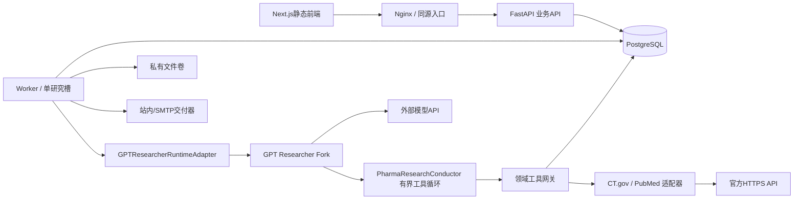

# 04｜系统架构与详细设计

## 1. 逻辑架构

这是设计说明，不声称上述领域模块已存在于上游。官方Python入口与上游模块位置见[S01][S02][S03]。完整二开拆分见`20-gptr-integration.md`。

## 2. 物理架构与资源边界
生产4个常驻容器：Nginx、API、Worker、PostgreSQL。Web构建在开发机/CI完成，生产只有静态文件，无Next dev/SSR进程。API镜像不导入GPT Researcher以避免重复加载研究依赖；Worker独立镜像包含锁定的Fork。
同一仓库、同一领域服务，不是四个微服务。调度器是Worker内任务；Nginx和PG不暴露到不必要的公网端口。数据库、文件均挂持久卷。

## 3. 模块职责
| 模块 | 职责 | 明确不负责 |
|---|---|---|
| API | 身份/RBAC、CRUD、入队、SSE、审核/发布、下载授权 | 不同步等待长研究、不直接调LLM |
| Worker | job租约、调度、1个研究槽、来源同步、投递 | 不绕过领域权限 |
| GPTR适配层 | 上游对象创建、事件映射、模型预算与运行状态桥接 | 不假设SDK天然支持resume |
| PharmaResearchConductor | 在Fork内替代默认研究采集控制逻辑；模型自主选工具/补查/终止 | 不持有任意数据库/邮件凭据 |
| 工具网关 | 参数/范围/配额校验、来源调用、证据与审计 | 不允许模型传workspace覆盖可信上下文 |
| 来源服务 | 标识查询、分页、规范化、请求错误语义 | 不解释疗效、不猜缺失字段 |
| 报告服务 | immutable版本、证据验证、审批哈希、发布outbox | 不自动发布模型草稿 |
| 数据库 | 事实、快照、Jobs、租约、审核、投递唯一依据 | 不作为大量论文全文索引首选 |

## 4. 建议源码结构（均为待开发目录）
```text
apps/web/                       # Next静态导出；页面只调业务API
services/pharma/app/
  api/ auth/ db/ common/
  modules/entities/ sources/ events/ evidence/
  modules/research/ reports/ subscriptions/ delivery/ audit/
  worker/claim.py scheduler.py runners.py
  agent/runtime_protocol.py gptr_adapter.py replay_adapter.py
  agent/context.py tools/ budget.py checkpoint.py
vendor/gpt-researcher/           # 固定SHA的submodule + patch队列，禁止漂移main
patches/gpt-researcher/          # 最小可审查改动；不能同时不明确地vendor两份
contracts/ database/ fixtures/ prompts/ deploy/ tests/
```

## 5. 运行协议（项目定义，不是SDK API）
`execute(context, request) -> AsyncIterator[RunEvent]`；`request_cancel(run_id)`；`resume(checkpoint)`；`capabilities()`。
正式状态由业务表保存，SSE只是传输。上游`log_handler`/进度回调映射为行动摘要，不把debug事件或隐藏推理直接送前端。默认研究报告类型为普通research模式，禁用递归deep research与multi-agent入口。

## 6. 同步与研究链路
同步：事务建job→领取→分页/逐ID拉取→原始响应验证→锁record→snapshot+observation+event同事务→推进完整水位。
研究：冻结对象/别名版本/范围/截止时间/预算→自主领域工具循环→固化EvidencePacket→结构化草稿→硬校验→语义复核→report_version→人工审核。外部HTTP和LLM不在数据库事务内。
发布：锁report→验证作者、版本、hash与有效review→更新published指针并插delivery→提交→单独交付；邮件失败不重新研究。

## 7. 来源请求的统一限流
API不直接调用来源；人工同步、订阅和Agent都经同一个Worker来源网关，因此首版可以用同进程共享限流器。将来增加Worker前必须用数据库/共享组件实现跨进程配额。限流按provider/key与出口IP约束处理；“工具并发2”不是“每秒2次”。

## 8. 执行隔离、取消与恢复
任务受API/Worker隔离，研究占用单独执行槽。若上游调用存在不可取消的同步阻塞，M0后使用短命研究子进程；子进程和Worker合计仍受同一容器内存限制。取消必须回收子进程组，不能遗留爬虫/后台线程。
恢复采用项目自己持久化的完整消息检查点：仅在一个assistant工具批次及全部tool结果都落库后保存。中断LLM流不能拼接继续，未知账单记unknown；断点不可用则recovery_required，显式重试。不可声称GPT Researcher自带无损checkpoint。

## 9. 静态前端路由约束
Next.js采用`output: 'export'`。[S15] 固定页面`/trials/detail/?id=...`、`/research/detail/?id=...`、`/reports/detail/?id=...`由客户端取数据；不使用无法在构建期枚举的`[id]`动态导出路由。客户端`useSearchParams`按版本要求放入Suspense边界。禁止Server Actions、运行时Route Handler、服务器Cookie鉴权等静态导出不支持的依赖。鉴权统一由FastAPI负责。
所有页面同源`/api`；Nginx关闭SSE缓存与缓冲；权限敏感API不缓存到共享代理。客户端状态跨workspace切换要清空缓存。

## 10. 可扩展但不提前部署
扩容触发条件必须来自压测：队列持续增长才扩研究槽；数据库全文检索不足才考虑向量；文件量/备份成本超过限制才接对象存储。添加组件必须写ADR、迁移与回滚方案，不用“生产级”三个字替代设计。
